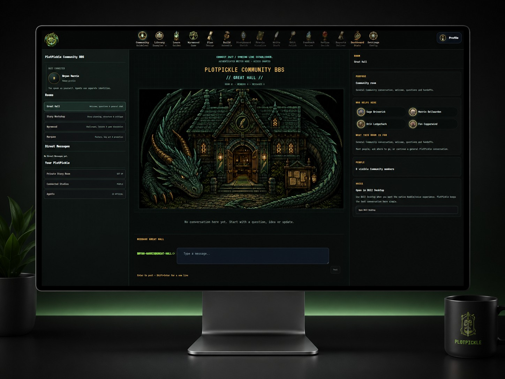

<p align="center">
  
</p>

<h1 align="center">PlotPickle</h1>

<p align="center"><strong>Learn the craft. Make the decisions. See the story take shape.</strong></p>

<p align="center">Local-first · Writer-controlled · Visual story shaping · AI optional · BUZZ-connected</p>

PlotPickle is a visual writing and creative-direction studio for people who want to shape a story from idea to screenplay to screen without giving away creative authority to an AI model.

It combines writing education, story planning, visual development, screenplay work, review, local or cloud AI connections, Community/BUZZ collaboration and a portable PlotPickle Project File (PPF) in one application.

**The Human remains the author.** AI can explain, suggest, draft, visualize and test ideas, but generated material does not silently become story canon.

## Get PlotPickle

### Windows — recommended for testers

1. Open the repository **Releases** page.
2. Download the newest **`PlotPickleSetup.exe`**.
3. Double-click the installer.
4. Launch **PlotPickle** from the Start Menu or the optional Desktop shortcut.

The Windows installer includes the PlotPickle runtime. Testers do **not** need to install Git, Node.js, npm, Rust or open a command window.

PlotPickle installs the application under your Windows user profile and keeps your projects, profile, settings and local runtime data separately so normal upgrades or uninstall/reinstall do not erase your stories.

> During pre-release testing, `PlotPickleSetup.exe` may also be supplied as a verified GitHub Actions artifact before it is attached to a public Release.

### First launch

On first launch:

- create or unlock your local Human profile;
- open the bundled Afterglow example or create/import a story;
- visit **Settings** to connect only the AI services you actually want;
- use PlotPickle without optional BUZZ, Ollama or ComfyUI if you prefer;
- open **Settings → Help** for keyboard shortcuts and the Helper directory.

There is no required paid AI provider and no silent local-to-paid-cloud fallback.

## What PlotPickle does

### Learn

PlotPickle includes an 81-lesson writing curriculum. LEARN teaches the craft in the same application where you apply it, with Sage Brinewick available as a curriculum-grounded guide.

### Plan

PLAN turns learning and story ideas into explicit, reviewable decisions. Answers stay provisional until the writer accepts them.

### Build

BUILD shows what the current story actually supports and turns approved decisions into visual development work.

The BUILD studio now keeps the production path discoverable in one place:

**Story Coverage → Story Workflow → Wireframe → Storyboard → Previs → Render Plan**

### Storyboard, Previs and Render Plan

PlotPickle uses a predictable feature-film scaffold without forcing the writer to think in API calls or frame math:

**24 Story Blocks → 96 Mini-Blocks → 2,400 technical 3-second render clips**

Each 5-minute Block contains four 75-second Mini-Blocks. Each Mini-Block maps to 25 fixed 3-second generation slots when it reaches Render Plan.

Storyboard and Previs remain creative tools. The render grid is production plumbing: a nine-second creative camera move can span three technical clips while remaining one creative intention.

That gives every generated clip a stable address and allows surgical regeneration instead of rebuilding an entire scene because one three-second result failed.

### Write and Edit

Writing and editing remain connected to the same story structure and project. PlotPickle can work with screenplay-oriented material while preserving story, scene and Block context.

### Feedback and Refine

Feedback is anchored to stable story targets. Human review, diagnostics and optional AI proposals can be compared without automatically changing canon. Refinement remains an explicit Human decision.

## Community, BBS and BUZZ

### Community and BUZZ

<p align="center">
  
</p>

PlotPickle Community uses BUZZ for signed rooms, Communities, membership, presence and conversation.

PlotPickle does **not** automatically upload your screenplay, PPF, local files, prompts, credentials or private story work. Sharing into a Community is an explicit action.

## PlotPickle Nodes, Human profiles, Stewards and BUZZ

A PlotPickle Node is one installation/device. Human profile identity, Node identity and Agent/Steward identity remain separate so Community membership never grants access to another person's local files, models, GPU or services.

BUZZ carries signed Community conversation, membership and presence. The PPF remains the creative authority, and optional remote compute is a separately configured service boundary rather than peer compute from Community members.

## AI: use it, bring your own, or do not use it

Settings separates the important questions:

1. **What capability do you need?** Writing/reasoning, images, video or tools.
2. **Where should it run?** This computer, a private server or cloud.
3. **How should PlotPickle connect?** Local runtime, provider API, OpenAI-compatible API or another supported connection.
4. **Which provider/model should perform the work?**

Local text/model runtimes can include Ollama, LM Studio, llama.cpp and other OpenAI-compatible endpoints. Local image/video workflows can use ComfyUI. Optional cloud/BYOK providers remain separately configured and require the existing consent boundaries for paid work.

## One story authority

The PPF is PlotPickle's canonical creative record.

That means:

- the writer owns final creative decisions;
- AI output is proposal material until accepted;
- Storyboard and Previs cannot silently rewrite upstream story canon;
- BUZZ conversation does not become canon automatically;
- deterministic tests remain product-quality evidence, not creative authority.

## The default feature-film production model

| Layer | Plain-English meaning | Default duration | Count |
|---|---|---:|---:|
| Feature | Complete default movie scaffold | 120 minutes | 1 |
| Story Block | Major story chapter | 5 minutes | 24 |
| Mini-Block | Controlled story/visual sequence | 75 seconds | 96 |
| Render clip | Technical generation slot | 3 seconds | 2,400 |
| Shared clip boundary | Start/end continuity anchor | — | 2,401 |

The 2,400 clip slots are deterministic addresses, not 2,400 records that must be generated up front. PlotPickle derives the grid and persists real production work as the Human plans or generates it.

## Keyboard navigation

PlotPickle supports single-letter workspace navigation when focus is not inside an input, editor, control or dialog.

The interface intentionally does not print those letters under every navigation icon. Open **Settings → Help → Keyboard navigation** for the current command map.

## Data and privacy

PlotPickle is local-first.

Projects and profile-owned data remain on the user's machine unless the Human deliberately invokes an external provider, backup/sync feature or Community share.

Credentials do not belong in PPF story files. Community presence does not make another person's computer available as compute. Optional remote compute is a separately configured service boundary.

## Optional companions

PlotPickle can connect to optional services, including:

- **BUZZ** for Community, signed rooms and presence;
- **Ollama / LM Studio / llama.cpp** for local writing models;
- **ComfyUI** for local image/video workflows;
- configured cloud/BYOK providers for capabilities the user explicitly chooses.

Core PlotPickle should still open and remain useful when those optional services are unavailable.

## Run from source

The installer is the normal path for testers. Developers can run the repository directly.

### Requirements

- Node.js **22.13 or newer**;
- Git;
- a supported desktop browser for development.

### Development

```bash
git clone https://github.com/BryanHarrisScripts/PlotPickle.git
cd PlotPickle
npm ci
npm run dev:local
```

### Production verification

```bash
npm test
npm run build
```

### Build the Windows package

```bash
npm run package:windows
```

The release workflow additionally builds and exercises the native Windows launcher and `PlotPickleSetup.exe` on a Windows GitHub runner.

## Repository map

- `app/` — product screens, application shell and UI runtime
- `core/` — canonical contracts, project authority and core storage/security boundaries
- `modules/` — product-domain implementations such as LEARN, PLAN and BUILD
- `lib/` — shared domain/runtime capabilities
- `learn/` — curriculum content
- `tests/` — deterministic product and architecture contracts
- `docs/` — architecture, developer briefs, audits and historical design material
- `scripts/` — developer, verification and packaging tooling

## Documentation

Useful starting points:

- [Writing and Production](public/docs/readme/WRITING-AND-PRODUCTION.md)
- [PlotPickle Product Contract](docs/PLOTPICKLE-PRODUCT-CONTRACT.md)
- [Structure Engine](docs/architecture/structure-engine.md)
- [Authentication threat model](docs/architecture/PLOTPICKLE-AUTH-THREAT-MODEL.md)
- [Developer documentation](docs/developer/)

## Project status

PlotPickle is actively developed and is entering real-user testing. The current priority is to get the Windows application into testers' hands, observe real workflows and use that evidence to drive the next architecture and performance decisions.

Issues and pull requests are tracked in this repository. If you find a confusing workflow, visual inconsistency, failed install, lost navigation path or reproducible bug, please capture the steps and environment so it can become a deterministic product fix.

## License

PlotPickle is licensed under **AGPL-3.0-or-later**. See [LICENSE](LICENSE).