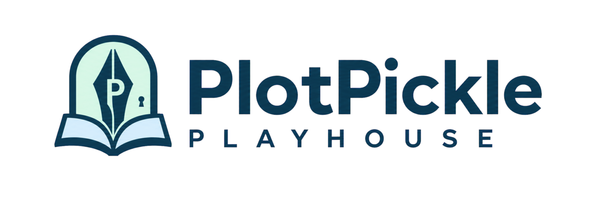

<p align="center">
  
</p>

# PlotPickle

**A local-first visual storyworld collaboration and previsualization engine.**

PlotPickle keeps story logic, canon, characters, screenplay material, Graphic Novel panels, Storyboard frames, production planning, review evidence and provenance connected in one portable PPF project. The Dashboard presents the real loaded project, writing progress, Storyworld Overview, GitHub approval state, local storage, unresolved canon decisions and the optional Buzz workspace without fictional collaborators or decorative product mockups.

[Getting Started](public/docs/readme/GETTING-STARTED.md) · [Writing & Production](public/docs/readme/WRITING-AND-PRODUCTION.md) · [Collaboration & Development](public/docs/readme/COLLABORATION-AND-DEVELOPMENT.md) · [Official repository](https://github.com/BryanHarrisScripts/PlotPickle) · [About PlotPickle](app/about/page.tsx) · [OpenStory history](docs/history/from-openstory-to-plotpickle.md)

## Five reasons to use PlotPickle

1. **Visual storyworld in one PPF** — keep canon, characters, structure, screenplay material, visuals, approvals and provenance connected.
2. **Story logic you can see** — use 24 Blocks, 96 mini-blocks and the 81-module learning system to expose hooks, turning points, causality, arcs and continuity.
3. **Connected visual development** — carry approved identities and locations through Graphic Novel, Storyboard, Production Shots and Animatic.
4. **A clearer case for the movie** — use the Storyworld Map, screenplay, Graphic Novel, Storyboard, Feedback, Pitch and Reports to make readiness and unresolved decisions visible.
5. **Local-first ownership with optional connections** — use AI, GitHub, Google and Buzz only when deliberately configured.

## The visual storyworld core

**The complete visual storyworld core** keeps development, previsualization, review and ownership connected without requiring external services. PPF is the portable creative source of truth. It keeps structure, canon, screenplay material, visual decisions, production assets, approvals and provenance connected while the canonical local project folder remains authoritative. The core works without external APIs.

Available now:

- Interactive Storyworld Map
- Graphic Novel and Storyboard
- Production Shots and Animatic
- Feedback, Pitch and Reports
- owner-controlled Collab
- Buzz Story Rooms, encrypted existing-relay setup and a pinned managed local relay lifecycle

**Afterglow: Reflections of Sentience** remains the persistent reference project used to verify the connected visual storyworld, legacy visual boundaries and screenplay-version reconciliation.

## What PlotPickle does

- **PPF storyworld:** one portable creative source of truth for canon, structure, screenplay material, visuals, approvals and provenance.
- **Story logic you can see:** 24 Blocks, 96 mini-blocks, hooks, turning points, arcs, causality and continuity.
- **Visual development:** approved character and location identity flows into Graphic Novel, Storyboard, Production Shots and Animatic workspaces.
- **Evidence-led review:** Feedback, Pitch and Reports surface what is working, what is unresolved and what must be decided by people.
- **Owner-controlled collaboration:** GitHub Story Proposals and approvals live in Collab; only a human merge changes canonical repository content.
- **Optional Buzz workspace:** rooms, agents, media discussion and development activity sit beside Collab and remain dormant until configured in Settings.

## Current application model

The primary application navigation is:

`Dashboard · Learn · Plan · Storyboard · Write · Graphic Novel | Build · Feedback · Refine · Reports | Collab · Buzz | Settings`

- **Dashboard** shows the real current project, source authority, Storyworld Overview, writing progress, recent project evidence, GitHub state, Buzz state, storage and canon questions.
- **Learn** contains the Introduction, complete 81-module learning library, terminology and screenplay study.
- **Plan** develops foundations, world, characters, four acts, twelve sequences, 24 Blocks and 96 mini-blocks.
- **Storyboard** preserves approved visual identity and continuity across the movie.
- **Write** develops treatment and screenplay material from the same canonical project.
- **Graphic Novel** develops the 24-page, 96-panel visual presentation.
- **Build** owns structural arrangement. Structural arrangement belongs only to Build; Refine reads the same structure for diagnosis instead of exposing a second editor.
- **Feedback** remains the permanent structured review and resolution record.
- **Refine** provides diagnostic and specialist passes without creating a second structure editor.
- **Reports** measures screenplay, character, scene, production, continuity and readiness evidence.
- **Collab** owns GitHub Story Proposals, approvals, meetings and calendar coordination.
- **Buzz** owns optional rooms, agents, media discussion and development activity.
- **Settings** owns configuration, credentials, lifecycle, recovery, storage and removal for every optional connection.

## Buzz: optional and dormant by default

Buzz does not activate simply because PlotPickle is installed.

When Buzz is unconfigured:

- no Buzz process runs;
- no relay port listens;
- no Buzz identity, private key or credential file exists;
- no Buzz database, project room, media store or coding worktree exists; and
- PlotPickle remains fully usable.

Open **Settings → Integrations → Buzz** to choose an existing trusted relay or the PlotPickle-managed local relay. Existing-relay details and the Buzz identity are encrypted for the current operating-system user. The managed option installs the pinned Buzz `v0.4.26` Docker Compose bundle only after its manifest, checksums, Apache 2.0 licence files and local Docker prerequisites pass verification. It binds the relay to `127.0.0.1` and keeps install, start, stop, restart, repair, pinned update, backup, restore and removal actions explicit.

PlotPickle does not embed or advertise unverified platform-native Buzz executables, and it does not include the separate Buzz desktop client. The verified Docker-managed relay is an optional sidecar; PPF projects remain usable without it.

Developer Mode and coding agents remain future explicit capabilities. Any later coding integration is limited to isolated worktrees, branch-only changes, test evidence and human-controlled GitHub publishing. Agents may not read the PlotPickle credential vault or unrelated PPF folders.

## Optional connections

PlotPickle's complete local creative core works without external accounts or API keys.

| Settings area | Purpose | Default |
|---|---|---|
| **Story & Art** | Optional OpenAI, compatible-server, Ollama, manual-prompt or no-AI operation | Disconnected |
| **Repository & Collab** | Optional GitHub repository history, Story Proposals, approvals and recovery | Disconnected |
| **Scheduling & Meetings** | Optional Google Calendar and Meet | Disconnected |
| **Buzz** | Optional Story Rooms, encrypted relay identity and managed local relay | Not configured |
| **Media & Film Engines** | Future extension; no active API | Unavailable |

Provider-neutral render packages, automated returned-asset ingestion and third-party movie-rendering connectors are not active development commitments. Pika Labs, Runway and other media engines remain future extensions unless a separate verified implementation is approved.

Credentials remain in the private local-server credential area under the current operating-system user. They are never written into PPF projects, exports, reports, prompts, logs or GitHub commits.

## Local-first desktop builds

PlotPickle is packaged from one codebase for:

| Platform | Archive | Launcher |
|---|---|---|
| Windows | `PlotPickle-Windows.zip` | `Start-PlotPickle.bat` |
| macOS | `PlotPickle-macOS.zip` | `Start-PlotPickle.command` |
| Linux | `PlotPickle-Linux.zip` | `start-plotpickle.sh` |

Each release candidate is built on its target operating system and published with a SHA-256 checksum. There is no required PlotPickle cloud account, administrator installation, background Windows service or automatic startup entry.

## Windows first run

1. Download and extract the Windows archive.
2. Double-click `Start-PlotPickle.bat`.
3. Review the transparent dependency plan.
4. Approve installation only when the required runtime is missing.
5. Keep the command window open while using PlotPickle.
6. Press `Ctrl+C` to stop the local server.

PlotPickle binds to `127.0.0.1`. Replaceable application files remain separate from persistent runtime packages, local projects, credentials, backups and optional Buzz data.

## Storage, upgrades and removal

- Canonical project folders and PPF packages are separate from replaceable PlotPickle program files.
- Rolling backups and recovery are managed under **Settings → Storage & Backups**.
- Windows upgrades use `Update-PlotPickle.bat` and preserve the reusable runtime and local settings.
- Saved connection credentials can be reviewed and erased under **Settings → Privacy & Permissions**.
- Buzz connection details and the encrypted identity can be removed under **Settings → Integrations → Buzz** without deleting PlotPickle projects.
- Managed Buzz containers, volumes, runtime files, service secrets and backups have separate explicit lifecycle and removal controls.

## Collaboration authority

PPF remains authoritative for creative canon. GitHub remains authoritative for code, branches, pull requests and merges.

Complete local or private web-based PlotPickle installations can collaborate through the same owner-controlled repository. Writer, Director, Producer, Actor and Reviewer are roles within PlotPickle, not separate product editions.

- **Collab** coordinates formal Story Proposals, approvals, meetings and calendar activity.
- **Buzz** provides optional conversation, agent and development context.
- **Feedback** stores permanent structured review decisions.
- A Buzz message or agent suggestion never becomes PPF canon automatically.
- Only an explicit human approval applies a selected Buzz proposal to the local PPF.
- Only the project owner or an authorized maintainer can approve the repository merge that changes shared canonical material.

## Available now versus future packaging

Available now:

- complete local PPF project model;
- Dashboard, Learn, Plan, Storyboard, Write, Graphic Novel, Build, Feedback, Refine and Reports;
- Storyworld Map, Production Shots, Animatic and Pitch evidence;
- owner-controlled Collab and optional GitHub connection;
- optional Google Calendar and Meet setup boundaries;
- project-specific Buzz Story Rooms, linked discussion excerpts and human-reviewed local PPF proposals;
- encrypted existing-relay configuration, reachability testing and signed Buzz CLI room/message operations;
- a pinned Docker-managed local Buzz relay with explicit install, lifecycle, backup, restore and removal controls;
- Windows, macOS and Linux packaging validation.

Not yet claimed as shipped:

- embedded platform-native Buzz binaries or the separate Buzz desktop client;
- production coding-agent execution;
- active Pika, Runway or other third-party rendering connectors.

## Open source, licensing and ownership

- PlotPickle software: **GNU AGPLv3 or later**.
- 24 Blocks method and reusable learning documentation: **CC BY-SA 4.0**, with attribution to Bryan Elgin Harris.
- User-created stories, screenplays, characters, images, notes and PPF projects remain the user's creative work.
- Optional integrations do not transfer ownership to PlotPickle.

See [About PlotPickle](app/about/page.tsx), [licensing](app/legal/page.tsx), and [the OpenStory history](docs/history/from-openstory-to-plotpickle.md).

## Development and validation

```bash
npm ci
npm run lint
npm test
npm run build
```

Focused runtime coverage:

```bash
npm run test:managed-buzz-runtime
```

The release matrix validates Windows, macOS and Linux packages. Windows additionally runs clean-machine extraction, deterministic release smoke and packaged interaction checks.

Current application version: `1.0.0-rc.3`  
Current project schema: `1.7.0`
