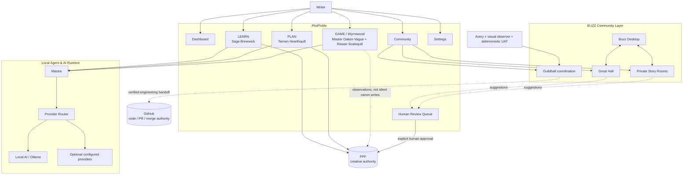

<p align="center">
  
</p>

# PlotPickle

Shape the story. Learn the craft. Test the choices. Keep the writer in control.

PlotPickle is a local-first, AI-assisted story development environment built around a deliberately small product spine:

Dashboard · Community · Learn · Plan · Wyrmwood · Settings

The current rebuild focuses on helping a writer learn story craft, apply it to a real project, test those choices through the Wyrmwood game, and collaborate through a shared BUZZ community without surrendering creative authority to an AI or an external service.

The broader PlotPickle modules still exist in the repository. They are parked off to the side until they are deliberately reworked into this simpler architecture. They are not considered part of the active product surface simply because old code still exists.

## Core product

### Learn

LEARN is the front door to PlotPickle's curriculum.

The writer reads the lesson in the centre, navigates the curriculum on the left, and works with Sage Brinewick on the right. Sage is the resident Lorekeeper: a conversational curriculum guide powered by the local Mastra agent runtime.

LEARN is intended to answer a simple question: what does the writer need to understand before making the next story decision?

### Plan

PLAN turns learning into editable story foundations.

Each foundation question includes three short prompts that help the writer think before answering. The writer can answer manually or select local AI to draft an editable answer. AI fills only the selected fields, keeps the result concise, and marks invented story choices as provisional rather than pretending they are canon.

Tamsin Hearthquill, Keeper of Foundations, is the PLAN agent.

### Wyrmwood

Wyrmwood is the GAME layer.

Instead of only explaining craft, PlotPickle can challenge the writer with a playable story problem derived from the curriculum. Master Oaken-Vague acts as the Rival Director and Rowan Scalequill evaluates the lesson-specific response.

The purpose of Wyrmwood is not to replace the writer's decision. It is to pressure-test whether the writer understands and can apply what was learned.

### Community

Community is PlotPickle's native collaboration surface, powered underneath by BUZZ.

The writer should normally stay inside PlotPickle. Buzz Desktop is a companion interface for owner-level administration and any BUZZ capability PlotPickle has not wrapped yet.

Community currently includes:

- the Great Hall for community-wide discussion;
- six private Story Rooms for Story, Characters, Structure, Continuity, Visual Development and Production Notes;
- people, membership and presence;
- Agents & Stewards with truthful runtime and BUZZ-presence status;
- a Review Queue for suggestions that may become human-approved PPF changes; and
- the Guildhall for internal agent, UAT, visual-review and development coordination.

Story Rooms are real BUZZ channels. A member with permission can read and comment on the same Story Room from PlotPickle or Buzz Desktop. PlotPickle does not maintain a second copy of the conversation.

### Settings

Settings is intentionally basic in the active rebuild.

It owns the connections needed by the core product: local AI, optional providers, BUZZ, runtime health and advanced details when required. Technical controls should stay out of the writer's way unless the writer chooses to open them.

## Architecture



## Authority boundaries

PlotPickle deliberately separates creative authority, agent runtime, community coordination and software development.

| Layer | Authority |
|---|---|
| Writer | Final creative decision maker |
| PPF | Canonical creative record |
| Mastra | Runtime for PlotPickle product agents |
| AI provider | Generates suggestions and drafts; never owns canon |
| BUZZ | Signed community, Story Room, coordination, presence and audit layer |
| GitHub | Canonical code, issue, pull-request and merge authority |
| UAT / visual observer | Evidence and quality signals; not creative authority |

A BUZZ message does not become story canon automatically. A Mastra response does not become story canon automatically. A generated PLAN answer remains editable. PPF changes require the writer's approval.

## Core agents and lore

| Name | Role | Core responsibility | Runtime |
|---|---|---|---|
| Sage Brinewick | Lorekeeper | LEARN curriculum mentor and conversational story guide | Mastra |
| Tamsin Hearthquill | Keeper of Foundations | PLAN foundations drafting and guidance | Mastra |
| Master Oaken-Vague | Keeper of the Wyrmwood | Creates playable curriculum-bound Wyrmwood challenges | Mastra |
| Rowan Scalequill | Arbiter of Lessons | Evaluates Wyrmwood responses against the supplied lesson | Mastra |
| Avery North | The Wayfarer | Synthetic first-time writer used for experience UAT | PlotPickle UAT |
| Luma Glassfern | Lantern Warden | Read-only rendered visual observer | Deterministic observer |
| Bram Gatewick | Gatewarden | Deterministic quality and UAT gate | UAT |
| Orin Ledgerbark | Archivist of the Hall | Optional BUZZ-native history and receipt steward | BUZZ |
| Fen Copperwind | Herald of the Forge | Optional BUZZ-native engineering handoff steward | BUZZ |

Additional lore roles remain preserved for broader PlotPickle modules and can return when those modules are reworked into the active product.

Mastra remains the brain for PlotPickle's product agents. BUZZ does not replace their reasoning runtime. When an owner-approved matching BUZZ identity exists, PlotPickle can show that agent as visible in the community while still reporting where the agent actually runs.

## BUZZ: community and coordination

BUZZ is now part of the core collaboration architecture rather than a separate writing product.

PlotPickle uses BUZZ for:

- community discussion;
- private Story Rooms;
- member access and presence;
- agent/steward visibility;
- Guildhall handoffs;
- Writer-in-Residence and UAT evidence;
- visual-review findings;
- runtime health; and
- verified development handoffs before GitHub work.

The Guildhall contains purpose-specific rooms such as the Lore Library, Wayfarer Journal, Wyrmwood Ring, Story Council, Thread Vault, Lantern Watch, Gatehouse, Forge, GitHub Herald and Long Archive.

BUZZ does not silently modify PPF and does not replace GitHub. PlotPickle keeps those authority boundaries explicit.

## Local-first AI

PlotPickle is designed to work with local AI first.

The active agent runtime is Mastra. Provider routing sits underneath it so the product is not tied to one inference application. Ollama can provide local models; additional configured providers can be used when the writer chooses them.

Local failures must not silently become paid cloud requests. Provider choice, availability and advanced routing belong in Settings.

## Quality loop

PlotPickle has two different kinds of quality checks.

Deterministic tests protect contracts, routing, builds and known product behavior. Avery North performs a synthetic writer journey through the active app, while a separate read-only visual observer inspects rendered layout facts. Avery never receives browser-evaluation powers.

The current Writer-in-Residence command is:

```powershell
node .\scripts\run-writer-in-residence.mjs --github-report
```

Synthetic findings can be promoted to GitHub issues, but they remain synthetic evidence and must not be confused with real-user feedback.

## Development

Requirements:

- Node.js 22.13 or newer
- npm
- optional Ollama/local models for local AI
- optional Buzz Desktop / BUZZ community for collaboration

Install and start the local development app:

```bash
npm install
npm run dev:local
```

Core validation:

```bash
npm run build
npm test
```

Pull requests that touch the active product are expected to pass the relevant focused PlotPickle validation, production build, hardware-aware local-AI contracts and BUZZ Guildhall contracts before merge.

## Current direction

The product direction is intentionally narrower than the historical repository.

Build the simplest strong writer journey first:

LEARN → PLAN → GAME / Wyrmwood

Support it with:

COMMUNITY / BUZZ + basic SETTINGS + deterministic UAT

Only bring a parked module back into the active surface when it has been reworked to fit this architecture and makes the writer's journey clearer rather than larger.

That rule applies to Dashboard expansions, Storyboard, Previs, Write, Edit, Graphic Novel, Build, Feedback, Refine, Reports, advanced collaboration and other historical PlotPickle capabilities. They are preserved, not deleted, but they do not define the current core product.

## License

PlotPickle is licensed under AGPL-3.0-or-later. See the repository license for details.
