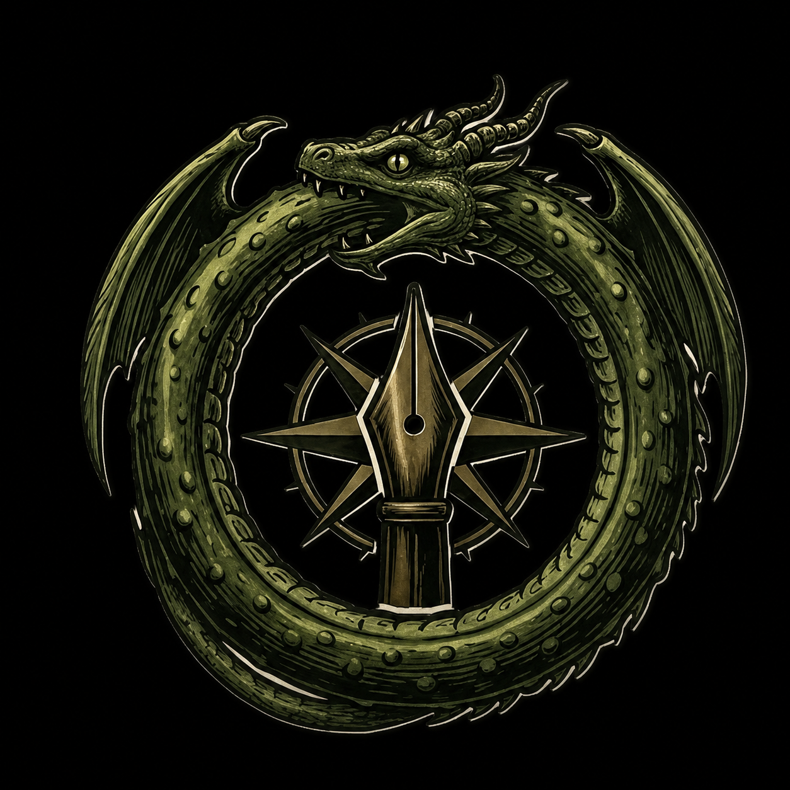
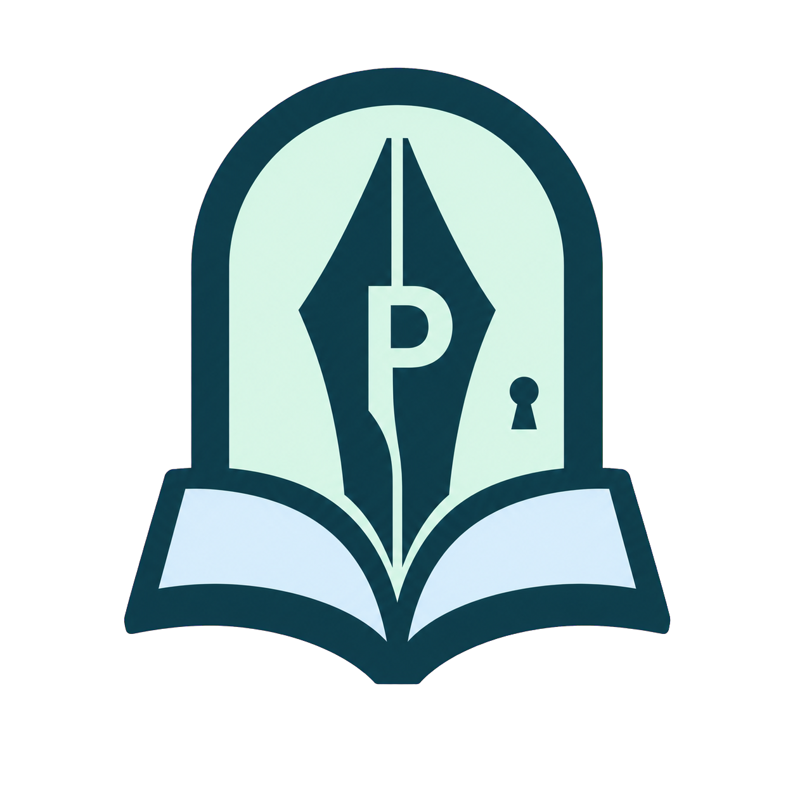
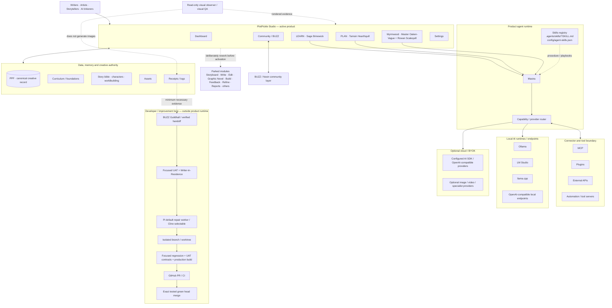

<p align="center">
  
</p>

# PlotPickle

Shape the story. Learn the craft. Test the choices. Keep the writer in control.

PlotPickle is a local-first, AI-assisted story development environment. The writer remains the author; agents, models, tools and community systems help the writer learn, explore, test and refine decisions without silently taking ownership of the work.

The active product spine is deliberately small:

Dashboard · Community · Learn · Plan · Wyrmwood · Settings

<table align="center">
  <tr>
    <td align="center" width="110"><br><strong>Dashboard</strong></td>
    <td align="center" width="110"><br><strong>Community</strong></td>
    <td align="center" width="110"><br><strong>Learn</strong></td>
    <td align="center" width="110"><br><strong>Plan</strong></td>
    <td align="center" width="110"><br><strong>Wyrmwood</strong></td>
    <td align="center" width="110"><br><strong>Settings</strong></td>
  </tr>
</table>

The broader PlotPickle modules still exist in the repository. Storyboard, Write, Edit, Graphic Novel, Build, Feedback, Refine, Reports and other historical surfaces are parked until they are deliberately reworked into the simpler active architecture. Old code does not make a surface part of the current product merely because it still exists.

## Product layout contract

Active PlotPickle workspaces use one shared three-column room rather than each feature inventing its own layout.

On a normal desktop the shared contract is:

- left: 19% — navigation, curriculum, categories or room selection;
- centre: 56% — the active lesson, plan, game, conversation or work surface;
- right: 25% — persistent agent, help, status, authority or contextual guidance.

The shell remains three-column through the supported compact desktop range and then deliberately collapses to a single-column experience on smaller screens. LEARN, PLAN, Wyrmwood, Community and Settings follow this continuity contract. Any parked module that returns to the active product must adopt the same left-navigation / centre-work / right-context model.

This layout contract is separate from the system architecture diagram below. The architecture diagram explains how product, agents, engines, tools, data and the developer loop connect; it is not a literal screenshot of the application navigation.

## Core product

### Learn

LEARN is the front door to PlotPickle's curriculum.

The writer reads the lesson in the centre, navigates the curriculum on the left, and works with Sage Brinewick on the right. Sage is the resident Lorekeeper: a conversational curriculum guide powered by the local Mastra agent runtime.

LEARN is intended to answer a simple question: what does the writer need to understand before making the next story decision?

### Plan

PLAN turns learning into editable story foundations.

Each foundation question includes short prompts that help the writer think before answering. The writer can answer manually or ask a configured AI route to draft an editable answer. AI fills only the selected work, keeps invented story choices provisional, and does not pretend generated material is canon.

Tamsin Hearthquill, Keeper of Foundations, is the PLAN agent.

### Wyrmwood

Wyrmwood is the GAME layer.

Instead of only explaining craft, PlotPickle can challenge the writer with a playable story problem derived from the curriculum. Master Oaken-Vague acts as the Rival Director and Rowan Scalequill evaluates the lesson-specific response.

The purpose of Wyrmwood is not to replace the writer's decision. It is to pressure-test whether the writer understands and can apply what was learned.

### Community

<p align="center">
  
</p>

Community is PlotPickle's native collaboration surface, powered underneath by BUZZ.

The writer should normally stay inside PlotPickle. Buzz Desktop is a companion interface for owner-level administration and BUZZ capabilities PlotPickle has not wrapped yet. PlotPickle-owned Community and Guildhall surfaces use the same dark matte-black, teal/turquoise/jade and gold visual system as the rest of PlotPickle. PlotPickle does not patch another application's installed theme files.

Community includes the Great Hall, private Story Rooms, membership and presence, Agents & Stewards, the Review Queue and the Guildhall developer/coordination area. Story Rooms are real BUZZ channels rather than a second copy of the conversation.

### Settings

Settings owns the connections and runtime controls needed by the active product: local AI, optional providers, BUZZ, runtime health and advanced details when required.

Settings uses the same three-column room: categories on the left, active controls in the centre, and persistent help/status context on the right. Technical controls should stay out of the writer's way unless the writer chooses to open them.

## How PlotPickle works

The visual architecture poster is directionally correct, but the repository makes several important distinctions that the poster must preserve:

1. Pi and Cline are developer repair workers, not in-product AI engines.
2. Qwen, DeepSeek and similar names are model families, not inference runtimes. Ollama, LM Studio, llama.cpp and OpenAI-compatible endpoints are runtimes/endpoints.
3. The active product navigation is currently Dashboard, Community, Learn, Plan, Wyrmwood and Settings. The larger historical module set is parked, not active.
4. MCP, plugins, APIs and automation form the connector/capability boundary; Skills define PlotPickle procedures and do not grant new permissions.
5. Visual understanding / visual QA is intentionally separate from image generation.
6. The developer improvement loop is outside the shipped product runtime and ends at an exact tested GitHub head, not at an agent deciding to merge itself.

The corrected repository-level system map is:



## Authority boundaries

PlotPickle deliberately separates creative authority, product-agent runtime, community coordination and software development.

| Layer | Authority |
|---|---|
| Writer | Final creative decision maker |
| PPF | Canonical creative record |
| Mastra | Runtime for PlotPickle product agents |
| AI provider | Generates suggestions and drafts; never owns canon |
| Skills | Procedure/playbooks; cannot grant permissions the host does not already allow |
| MCP / plugins / APIs | Capabilities and connectors |
| BUZZ | Signed community, Story Room, coordination, presence and audit layer |
| GitHub | Canonical code, issue, pull-request and merge authority |
| UAT / visual observer | Evidence and quality signals; not creative authority |
| Pi / Cline | Developer repair workers; not product agents or model engines |

A BUZZ message does not become story canon automatically. A Mastra response does not become story canon automatically. A generated PLAN answer remains editable. PPF changes require the writer's approval.

## Core agents and lore

<p align="center">
  
</p>

| Name | Role | Core responsibility | Runtime |
|---|---|---|---|
| Sage Brinewick | Lorekeeper | LEARN curriculum mentor and conversational story guide | Mastra |
| Tamsin Hearthquill | Keeper of Foundations | PLAN foundations drafting and guidance | Mastra |
| Master Oaken-Vague | Keeper of the Wyrmwood | Creates playable curriculum-bound Wyrmwood challenges | Mastra |
| Rowan Scalequill | Arbiter of Lessons | Evaluates Wyrmwood responses against the supplied lesson | Mastra |
| Avery North | The Wayfarer | Synthetic first-time writer used for experience UAT | PlotPickle UAT |
| Luma Glassfern | Lantern Warden | Read-only rendered visual observer | Deterministic observer |
| Bram Gatewick | Gatewarden | Deterministic quality and UAT gate | UAT |
| Orin Ledgerbark | Archivist of the Hall | Optional BUZZ-native history and receipt steward | BUZZ |
| Fen Copperwind | Herald of the Forge | Optional BUZZ-native engineering handoff steward | BUZZ |

Mastra remains the brain for PlotPickle's product agents. BUZZ does not replace their reasoning runtime. Developer workers such as Pi and Cline are also separate from Mastra's product-agent runtime.

## Agent skills

PlotPickle separates procedure from capability.

- `AGENTS.md` is the shared development constitution for human developers and repository-aware coding agents.
- `.agents/skills/<skill-id>/SKILL.md` contains progressively disclosed job procedures.
- `config/agent-skills.json` is the lightweight discovery registry.
- skill metadata uses `skill://` URIs and is filesystem-first / MCP-Resource-ready.
- a skill never grants tool, credential, git, network, privacy or merge permissions that the host does not already provide.

Current registered procedures include UAT repair, Sage Brinewick, PLAN Foundations, Writer-in-Residence, Visual QA and BUZZ Guildhall reporting.

## BUZZ: community and coordination

BUZZ is part of the collaboration architecture rather than a second writing product.

PlotPickle uses BUZZ for community discussion, private Story Rooms, member access and presence, agent/steward visibility, Guildhall handoffs, Writer-in-Residence and UAT evidence, visual-review findings, runtime health and verified development handoffs before GitHub work.

BUZZ does not silently modify PPF and does not replace GitHub. PlotPickle keeps those authority boundaries explicit.

## Local-first AI

PlotPickle is designed to work with local AI first.

The active in-product agent runtime is Mastra. Provider routing sits underneath it so PlotPickle is not tied to one inference application or model family.

Local runtime / endpoint options include Ollama, LM Studio, llama.cpp and generic OpenAI-compatible local endpoints. Names such as Qwen and DeepSeek describe model families that can run behind those endpoints; they should not be documented as if they were equivalent to Ollama or llama.cpp.

Local failures must not silently become paid cloud requests. Provider choice, availability, hardware suitability and advanced routing belong in Settings.

## Development stack

This section describes the current repository stack on `main`. It intentionally uses current package versions rather than migration arrows so the README remains a snapshot of what PlotPickle actually builds with now.

### Frontend / application framework

- Next.js `16.3.0`
- React / React DOM `19.2.8`
- vinext `0.2.1` as the Vite/Next integration layer
- `@vitejs/plugin-rsc` `0.5.34` for the React Server Components graph
- Tailwind CSS `4.3.3`
- shared matte-black, teal/turquoise/jade and gold design language
- shared active-workspace shell: 19% / 56% / 25% on normal desktop, compact three-column range, then deliberate single-column collapse

### Build tooling and language

- TypeScript `6.0.3`
- Vite `8.2.1`
- ESLint `9.39.4`
- Node.js `>=22.13.0`
- npm / `package-lock.json` is the checked-in package-management path
- repository automation is predominantly JavaScript/ES modules (`.mjs`) plus shell, PowerShell and Windows `.bat` entry points where appropriate
- Windows-native startup remains a first-class supported development path

### Hosting / edge

- Cloudflare integration through `@cloudflare/vite-plugin` `1.51.1`
- Wrangler `4.120.0`
- Vite configuration can bind Cloudflare D1/R2 resources from the repository hosting configuration
- `npm run dev:local` starts the current Vite development path
- the README does not hard-code `127.0.0.1:4173`; the current repository no longer defines that as the canonical fixed development port

### Product-agent runtime

- Mastra `1.13.2` is the canonical in-product agent runtime
- Mastra memory/logging/libSQL packages support the local agent layer
- Agent Skills are registered through `config/agent-skills.json` and `.agents/skills/*/SKILL.md`
- MCP is a capability boundary; `AGENTS.md` remains the higher-level developer constitution

### AI provider / model layer

- PlotPickle routes by capability and provider abstraction rather than binding product features to one runtime
- local runtimes/endpoints: Ollama, LM Studio, llama.cpp and generic OpenAI-compatible endpoints
- optional configured cloud/BYOK routes sit behind the same product boundary
- model families such as Qwen, DeepSeek, Devstral/Codestral or other compatible models are selections behind a runtime, not architecture layers by themselves
- capability and hardware-aware selection should decide which model serves fast, quality, deeper reasoning, vision or repair work

### Visual generation and visual QA

PlotPickle keeps generation separate from understanding/quality review. Image/video backends are provider capabilities behind the routing layer; visual QA is performed by a read-only observer that inspects rendered evidence and does not become the writer or silently alter story state.

### Developer repair stack — outside the product

Pi and Cline are developer tools, not PlotPickle product agents and not local AI engines.

The supported pattern is:

UAT finding → deterministic repair wrapper → Pi or Cline → configured local coding model/runtime → isolated branch/worktree → focused regression + UAT contracts + production build → draft PR → GitHub CI → exact tested green head merge.

`AGENTS.md` explicitly requires that coding agents do not merge their own work.

### Testing / QA

- Node's built-in test runner (`node --test`) is the dominant focused regression path in the repository
- Playwright is used for rendered browser/e2e validation
- custom focused UAT and Writer-in-Residence harnesses exercise creator journeys
- a separate read-only visual observer supplies rendered layout facts
- production build and the relevant focused contracts remain independent gates

### Community / coordination

- BUZZ supplies community, Story Rooms, Guildhall coordination, presence and signed-event infrastructure
- Nostr is the underlying signed-event protocol layer
- PlotPickle accesses BUZZ through local gateway modules while Buzz Desktop remains an upstream companion application

### CI/CD and security

- GitHub Actions is the code integration and CI authority
- repository workflows include security/dependency automation such as CodeQL and Dependabot where configured
- the merge policy is exact-tested-head: focused regression/UAT contracts, production build and required CI must be green for the exact head that is merged

### Data / creative format

- PPF (PlotPickle File) is the canonical creative record / project interchange authority
- structured project/curriculum/story/character/world/asset evidence remains local-first and writer-controlled
- credentials and sensitive provider configuration are kept outside committed source data

### Optional product intelligence

External intelligence/observability services can be connected as optional integrations. They do not become required runtime dependencies and do not replace GitHub, BUZZ, Mastra, PPF or the provider abstraction.

## Quality loop

PlotPickle has deterministic tests and experience-oriented UAT.

Deterministic tests protect contracts, routing, builds and known product behavior. Avery North performs a synthetic writer journey through the active app, while a separate read-only visual observer inspects rendered layout facts. Avery never receives browser-evaluation powers.

The current Writer-in-Residence command is:

```powershell
node .\scripts\run-writer-in-residence.mjs --github-report
```

Synthetic findings can be promoted to GitHub issues, but they remain synthetic evidence and must not be confused with real-user feedback.

## Development

Requirements:

- Node.js 22.13 or newer
- npm
- optional local AI runtime/models for local AI
- optional Buzz Desktop / BUZZ community for collaboration

Install and start the local development app:

```bash
npm install
npm run dev:local
```

Core validation:

```bash
npm run build
npm test
```

Focused product work should also run the relevant UAT contracts. The shared development rules in `AGENTS.md` require the relevant regression, focused UAT contracts, production build, a clean diff and green GitHub CI on the exact head before merge.

## Current direction

The product direction is intentionally narrower than the historical repository.

Build the simplest strong writer journey first:

LEARN → PLAN → GAME / Wyrmwood

Support it with:

COMMUNITY / BUZZ + basic SETTINGS + deterministic UAT

Only bring a parked module back into the active surface when it has been reworked to fit this architecture and makes the writer's journey clearer rather than larger.

That rule applies to Dashboard expansions, Storyboard, Previs, Write, Edit, Graphic Novel, Build, Feedback, Refine, Reports, advanced collaboration and other historical PlotPickle capabilities. They are preserved, not deleted, but they do not define the current core product. When one returns to the active surface, it must adopt the same left-navigation / centre-work / right-context three-column continuity contract rather than introducing another full-width layout system.

## License

PlotPickle is licensed under AGPL-3.0-or-later. See the repository license for details.
