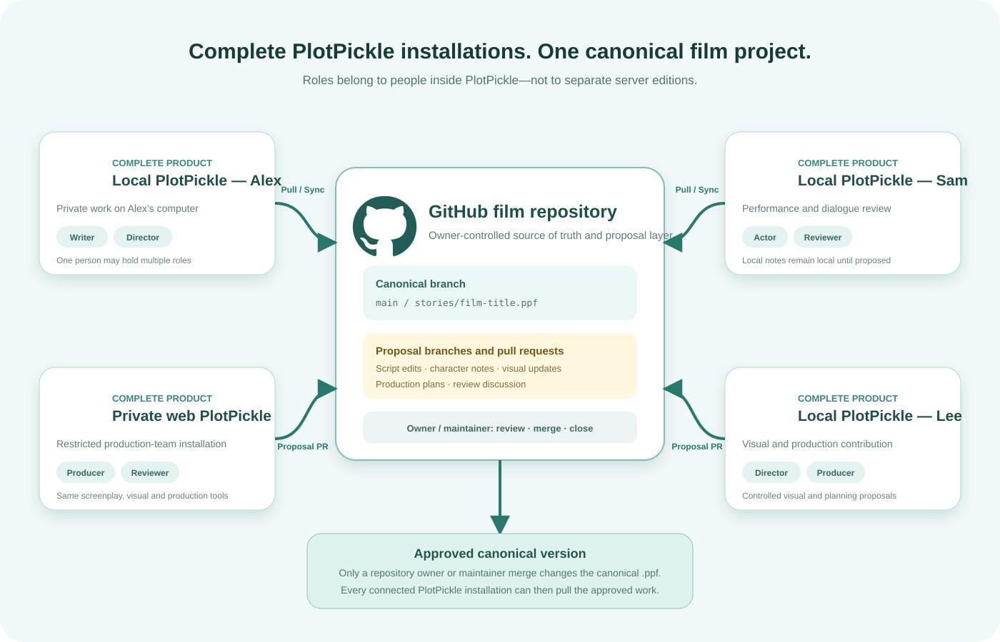

# PlotPickle Playhouse

<table><tr><td><strong><a href="public/docs/readme/GETTING-STARTED.md">Getting Started</a></strong></td><td><strong><a href="public/docs/readme/WRITING-AND-PRODUCTION.md">Writing &amp; Production</a></strong></td><td><strong><a href="public/docs/readme/COLLABORATION-AND-DEVELOPMENT.md">Collaboration &amp; Development</a></strong></td></tr></table>

The complete README is also available as three selectable tabs inside **Instructions → Project Overview**. No documentation was removed; the tabs reorganize the full guide by task.

[Official PlotPickle GitHub repository](https://github.com/BryanHarrisScripts/PlotPickle) · [About PlotPickle](app/about/page.tsx) · [How OpenStory evolved into PlotPickle](docs/history/from-openstory-to-plotpickle.md) · [Legacy README disposition map](docs/history/legacy-readme-map.md)

PlotPickle is a downloadable visual storyworld and AI previsualization engine for seeing whether a movie works before full production. It connects story logic, canon, characters, visuals, shots and sound in one portable PPF project, then helps approved material grow toward a watchable prototype for a green-light decision.

PlotPickle grew from the Afterglow screenplay, the 24 Blocks learning archive and several OpenStory experiments. The current product is one local-first application with optional AI, owner-controlled collaboration and explicit rights and provenance records. It is not intended to replace Final Draft or a studio production and finishing pipeline. Historical GPT, web3, token, DAO, revenue and autonomous-agent ideas are preserved as history rather than current roadmap commitments.

## Five reasons to use PlotPickle

1. **Visual storyworld in one PPF** — keep canon, characters, structure, screenplay material, visuals, shots, sound and provenance connected in one portable creative source of truth.
2. **Story logic you can see** — use 24 Blocks, 96 mini-blocks and the 81-module learning system to expose hooks, turning points, causality, arcs and continuity.
3. **Connected visual development** — carry approved character identities, world references, Graphic Novel panels, storyboard frames and Production Shots through one visual language.
4. **A path to a watchable prototype** — develop the existing visual workspaces into a provider-neutral rendering loop, returned assets, an Animatic prototype and green-light evidence.
5. **Local-first ownership with optional AI** — control projects, files, canon, approvals and providers while using AI, external renderers and GitHub only when deliberately chosen.

## Storyworld to prototype

PPF is the portable creative source of truth for the storyworld. It keeps structure, canon, screenplay material, visual decisions, production assets, approvals and provenance connected while each workspace presents the resolution needed for the current task. On disk, the canonical local project folder remains authoritative; `.ppf` packages carry the same project model for exchange, selective sharing and backup.

### Available now

- **Whole Film** displays the story across 24 Blocks and 96 mini-blocks.
- **Graphic Novel** turns the canonical story into a 24-page, 96-panel visual presentation.
- **Storyboard** develops frames from approved characters, locations, visual language and directed prompts.
- **Production Shots** adds shot intent, camera direction, keyframes, timing and production context.
- **Animatic** plays available frames and production material as timed previsualization.
- **Pitch and Reports** present story, continuity, readiness and production evidence for review.
- **Afterglow: Reflections of Sentience** is the persistent reference project used to verify this workflow.

### Conversion roadmap

- **Whole Film → Storyworld Map:** add relationships, hooks, turning points, arcs, causality and continuity to the existing wall through a rebuildable derived index.
- **Graphic Novel + Storyboard + Production Shots → shared rendering:** generalize the existing prompt and queue foundations into provider-neutral image and video packages.
- **Generated assets → PPF:** return images, clips and approved variations to stable shared assets with continuity and provenance.
- **Animatic + Pitch + Reports → watchable prototype:** assemble returned material into a reviewable prototype and green-light package.

The roadmap converts existing functions instead of creating parallel engines. External renderers remain optional, no provider is promised before its integration is verified, and PlotPickle does not currently claim to render a complete movie.

Writer, Director, Producer, Actor and Reviewer are roles within PlotPickle, not separate server editions. One person may hold several roles. Local work remains local until it is explicitly proposed or synchronized; only an owner or maintainer merge changes the canonical `.ppf` project.

Complete local or private web-based PlotPickle installations can coordinate through the same owner-controlled repository without turning collaboration into the product's primary purpose.



[Windows Unknown Publisher explanation and fix](docs/windows-publisher-warning.md) · [AI readiness review](docs/ai-readiness-review.md)

## PlotPickle 1.0 candidate — Collaboration and Release Engineering

Settings → Setup → GitHub & Backups provides a disk-backed `.ppf` project library, rolling backups, canonical pulls and owner-controlled collaboration proposals. Every complete local or private web-based PlotPickle installation can submit controlled work through a unique GitHub branch and pull request; only an owner or maintainer merge changes the canonical story. Afterglow: Reflections of Sentience links directly to its current GitHub source repository. Windows, macOS and Linux release candidates are clean-machine tested and published with SHA-256 checksums, while local-only writing continues to require no PlotPickle or cloud account.

## PlotPickle 0.17 — Page to Production

Open `/production` to connect the 24 Blocks, flexible scenes, screenplay, storyboard frames, shot coverage, keyframes, Sonic Bible, cue sheet, animatic playback, production breakdowns, shoot schedule and distribution plan. Afterglow now includes twelve new replacement concept keyframes for Blocks 22–24.

## PlotPickle 0.16 — Pitch and Review Workflows

Open `/pitch-review` to move from guided logline development through local anchored comments, review-thread resolution, revision snapshot comparison and a complete pitch package. The same active project produces a browser PDF layout, self-contained HTML package and presentation-ready Markdown deck. Review anchors use stable project IDs and all decisions remain local to the canonical PlotPickle project.

## PlotPickle 0.15 — Specialist Labs

PlotPickle now includes `/labs`, a review-first workspace containing the AI Prompt Lab, Dialogue Lab, Structured Research & Canon Binder, Visual Bible and mood boards, prompt and generated-asset provenance, and saved specialist passes with before/after comparison.

Every lab reads the same canonical schema 1.7 project. Suggestions remain temporary until the writer explicitly approves them. Approved work is applied to existing story, screenplay, research, visual-language or provenance fields and saved inside normal revision history; no parallel lab database is created.

The PlotPickle 0.14 Diagnostic Craft Layer remains available at `/diagnostics`, with focused findings inside Structure, Writer and DraftLens.

PlotPickle is a local-first visual storyworld and AI previsualization engine built around Bryan Harris’s 24 Blocks method. One canonical project powers the complete hierarchy from story logic and canon to sequence, Block, flexible scene plan, mini-block, screenplay material, visual development, production shots, animatic playback and review evidence.

Current application version: `1.0.0-rc.3`

Current released project schema: `1.7.0`

## Official distribution

PlotPickle is officially distributed as a **downloadable local-server application**.

[Download the current PlotPickle Playhouse ZIP](https://github.com/BryanHarrisScripts/PlotPickle/archive/refs/heads/main.zip)

The local edition runs on the user’s own computer and opens in a browser at `http://127.0.0.1:4173`. There is no required PlotPickle cloud account and no official online PlotPickle service.

Because the repository is currently private, sign into the GitHub account that has access before downloading.

## Easiest Windows setup

1. Download the current ZIP.
2. Right-click the ZIP and select **Extract All**.
3. Open the extracted `PlotPickle-main` folder.
4. Double-click `Start-PlotPickle.bat`.
5. Review the installation plan and press **Y** only when a dependency runtime is genuinely required.
6. Leave the command window open while using PlotPickle.
7. Press `Ctrl+C` when finished, then close the command window.

PlotPickle requires Node.js 22.13 or newer. The first successful launch installs a reusable dependency runtime under the current Windows user’s local application-data folder. Later launches and matching future downloads reconnect to that runtime instead of installing all packages again.

The command window is PlotPickle’s private local server. Closing it stops the application. The launcher binds to `127.0.0.1`, so the default local edition is available only on that computer.

## Easy upgrades without reinstalling everything

Application files and installed packages are separated:

- replaceable PlotPickle program files remain in the extracted folder;
- reusable packages live under `%LOCALAPPDATA%\PlotPickle\runtimes\<dependency fingerprint>`;
- npm downloads are cached under `%LOCALAPPDATA%\PlotPickle\npm-cache`;
- browser-stored story projects remain outside the program folder.

### Recommended routine upgrade

1. Close PlotPickle and its local-server command window.
2. Double-click `Update-PlotPickle.bat` inside the existing PlotPickle folder.
3. Download the current ZIP through the signed-in browser.
4. Return to the updater and select the ZIP.
5. The updater replaces managed program files while preserving the runtime and local settings.
6. Choose whether to start the upgraded PlotPickle immediately.

A downloaded ZIP can also be dragged directly onto `Update-PlotPickle.bat`.

The launcher fingerprints `package-lock.json`. When the fingerprint matches an installed runtime, PlotPickle starts without running npm. A new dependency runtime is created only when the dependency fingerprint changes or the current runtime is damaged.

See `docs/windows-upgrades.md` for the complete upgrade and recovery guide.

## Transparent guided installer

Before any packages are downloaded, the Windows launcher displays:

- PlotPickle, Node.js, and npm versions;
- the dependency fingerprint;
- every requested top-level package and version;
- the application folder, persistent runtime, and npm cache;
- current disk space and a recommended 2 GB free-space allowance;
- a Y/N consent prompt only when installation is needed;
- visible installation and repair progress; and
- a final **SUCCESS** report with verified versions and actual dependency size.

The launcher does not request Administrator rights, install a Windows service, add itself to startup, disable Windows Security, or upload the active story project.

## Primary workspaces

- **Dashboard** opens the active project overview and provides New, Import, Export and Afterglow actions.
- **Instructions** explains the 24 Blocks method, Project Overview and every story column.
- **Learn** opens Read & Learn with the complete 81-module learning system, terminology and contextual craft guidance.
- **Plan** opens Story Planner with optional Simple Start, story foundations, world, characters, structure and notes.
- **Write** opens the Screenplay workspace for treatment, screenplay writing, import, revision and the complete script view.
- **Storyboard** opens Visual Board for character identity locks, visual language, 24 Blocks, 96 frames, pitch images and diagnostics.
- **Refine** opens diagnostic and specialist passes for resonance, voice, page, draft, craft and production. Structural arrangement belongs only to Build; Refine links back to Build’s contextual structure diagnostics instead of exposing a second editor.
- **Reports** measures screenplay, character, scene, production and schema coverage from the active project.
- **Settings** contains preferences and Setup for GitHub, AI, music and future optional providers.

Every workspace reads and writes the same locally saved canonical project.

The Screenplay workspace starts with a Markdown treatment section for every mini-block. It includes formatting tools, live preview, section and complete-treatment export, word counts, optional AI cleanup that requires approval, and a deliberate handoff from prose into screenplay action. Treatment text is saved in the canonical local project and can contribute context to later visual-storyboard prompts.

Screenplay mode starts blank for a new movie and uses the existing Story Setup, World, Characters, Ghost, Catalyst, 24 Blocks, flexible scene plan and 96 mini-blocks as its writing foundation. Every screenplay element retains its Block and mini-block assignment. The editor estimates page and scene counts, uses screenplay-standard spacing, and exports Fountain and Final Draft FDX; Print / PDF uses the screenplay page layout.

Read & Learn provides 81 searchable learning modules drawn from PlotPickle’s screenwriting documentation. Learning paths cover concept-to-draft, character and inner journey, structure and dramatic questions, scene construction, visual writing, dialogue, subtext, silence, theme, pacing, revision, collaboration, ownership and screenplay formatting. Recommended lessons follow the active Block and mini-block, provide an immediate exercise, and open the correct workspace for application. The educational guidance remains CC BY-SA 4.0; each writer’s creative work remains their own.

PlotPickle accepts plain-text (`.txt`), Fountain (`.fountain` or `.spmd`), and Final Draft (`.fdx`) files. **Load a screenplay** in Learn and **Import** on the Dashboard use the same ingestion pipeline. A screenplay creates a complete schema 1.7 project and populates reviewable metadata, story, world, characters, voiceprints, arc matrices, 24 Blocks, scenes, 96 mini-blocks, Story Threads, rights, review, pitch, production and collaboration fields. Script-derived interpretations are visibly marked as suggestions until the writer reviews and confirms them.

Parsing and the initial structural extraction happen on the local device without AI. The source screenplay is stored in the canonical `.plotpickle.json` project so it travels with the project, while the writer retains ownership of the script. Importing an existing `.plotpickle.json` file restores that complete saved project.

## Optional AI foundation

PlotPickle’s AI layer is provider-independent and local-server mediated. The primary development and live-test target is **ChatGPT / OpenAI API**, using the writer’s own API key, while OpenAI-compatible servers, Ollama, manual prompt export, and no-AI operation remain supported choices.

Reports is a primary workspace and Terminology is part of Read & Learn. Optional connections are grouped under **Settings → Setup**, including **GitHub setup**, **AI setup** and **Music setup**. Future plugins remain disabled until an implementation is available.

The AI foundation includes:

- capability-based provider selection instead of hardcoded model assumptions;
- portable knowledge-source contracts and bounded project context packs;
- character identity locks, approved looks, continuity locks, and generation provenance;
- OpenAI Responses and GPT Image adapters;
- compatible-server and Ollama text adapters; and
- a replaceable asynchronous video-job contract.

In the downloaded local edition, verified connection credentials may be saved in PlotPickle’s private local-server data under the current computer account. AI Setup confirms the live connection, records the last successful check, and can test or remove the saved key. API keys and tokens are connection secrets, not project data, and are never written into browser settings, exported `.plotpickle.json` files, prompts, logs, provenance records or GitHub.

### Credential storage and removal

PlotPickle keeps provider credentials as separate files inside one private `secrets` folder. On Windows the default location is `%LOCALAPPDATA%\PlotPickle\secrets\`; new, updated and legacy credential files read after this upgrade are encrypted for the current Windows user with DPAPI. On macOS and Linux the files are restricted to the current operating-system user with owner-only permissions.

Settings → Privacy and permissions shows a sanitized inventory without displaying secret values. It can open the exact credentials folder or erase the complete folder in one action. Erasing credentials does not delete projects, assets or backups. A locally erased GitHub or AI token may remain active at its provider, so revoke it through that provider as well when complete invalidation is required.

GitHub setup displays a green **Ready** light only after PlotPickle confirms the repository, canonical branch, canonical `.ppf` path, Contents read/write access and Pull requests read/write access. The check does not create a file or pull request.

The Screenplay assistant can suggest material using the current Block, mini-block and character context, but inserts nothing until the writer approves it. Characters can generate a portrait through the connected image model; the local server saves the resulting asset under the current computer account and attaches it as the character reference.

See `docs/ai-architecture.md` for the complete architecture and delivery sequence.

## Specialist Labs

Open `/labs` from the Engines workspace.

- **AI Prompt Lab** creates bounded reusable prompts from canonical project context but does not execute or apply them automatically.
- **Dialogue Lab** compares a selected screenplay element with a voice- and pressure-aware alternative before replacement.
- **Structured Research & Canon Binder** records source, creator, URL, licence and the exact verified finding or canon decision.
- **Visual Bible & Mood Boards** reads existing character, location and storyboard assets, then proposes unified visual and continuity rules.
- **Prompt & Generated-Asset Provenance** records provider, model, prompt, retained output or asset, human contribution and approval decision without storing credentials.
- **Saved Specialist Passes** displays the before and after values preserved in canonical revision snapshots.

Every lab uses the sequence: prepare → compare → approve or discard → record. The pending suggestion is not saved to the project before approval.

See `docs/phase-c-specialist-labs.md` for the complete approval and provenance contract.

## Guided left-hand story rail

The story rail is grouped into four readable areas.

### Project

- **SS — Simple Start** offers an optional beginner pathway inside Story Planner.
- **OV — Project Overview** shows project identity, overall coverage, the next suggested task, structural totals, open questions, and ownership information.

### Foundation

- Story Setup
- Pitch & Vision
- World
- Characters
- Ghost
- Catalyst
- Foundations
- The Pickle
- Dialogue
- Core Model

### Structure

- **ST — Structure Map** summarizes 4 acts, 12 sequences, 24 blocks, the live scene count, 96 mini-blocks, and the Story Clock before the writer opens Build. A 48-scene feature plan remains the starting template rather than a fixed requirement.
- 24 Blocks

### Production

- Storyboard
- Notes

Each rail item displays a live state:

- `○` not started;
- `◐` in progress;
- `✓` substantially complete; or
- `!` an open question or continuity item needs attention.

## Engines workspace

The guided engine order is:

**Structure → Resonance → Voiceprint → PageFlow → DraftLens → CraftLoop → Specialist Labs**

- **Build structure workspace** expands and arranges the spine across 12 sequences, a flexible scene plan and 96 mini-blocks. Blocks and mini-blocks support pointer movement, keyboard alternatives, bounded undo/redo, debounced autosave and a local recovery snapshot while preserving stable IDs and linked screenplay, storyboard, feedback and production references.
- **Resonance Engine** aligns the central question with character choices, motifs, opening and closing images, and consequences.
- **Voiceprint Engine** develops character-specific speech from history, status, worldview, rhythm, vocabulary, emotion, and pressure.
- **PageFlow Engine** turns planning into visible, active, actor-playable screenplay description.
- **DraftLens Engine** converts reader experience into evidence, root diagnosis, and revision questions, supported by computed Scene Pulse, thread, ledger, arc, and timeline findings.
- **CraftLoop Engine** connects the method into a repeatable deliberate-practice cycle.
- **Specialist Labs** provides controlled prompt, dialogue, research, visual and provenance passes with writer approval.

The suggested order is not mandatory. Writers may enter whichever engine or lab addresses the current story problem. The complete Diagnostic Craft workspace is available at `/diagnostics`.

## Complete structural hierarchy

**4 Acts → 12 Sequences → 24 Blocks → Flexible Scenes → 96 Mini-Blocks → Beats → Shots**

At the original 120-minute preset, the default reference model provides:

- 30 minutes per act;
- 10 minutes per sequence;
- 5 minutes per block;
- an initial two-scene distribution per block, producing a 48-scene starting template;
- 75 seconds per mini-block;
- 4 beats and 16 shots per mini-block;
- 384 beat targets and 1,536 shot targets overall; and
- approximately 4.69 seconds average shot length.

These are editable planning references, not mandatory filmmaking rules.

## Project data and migration

Released projects use canonical schema `1.7.0`. Imports from schemas 1.0 through 1.6 are upgraded non-destructively.

Migration preserves existing story, world, character, dialogue, note, screenplay, block, scene, mini-block, and visual data while adding dynamic scene fields, Story Threads, Character Arc Matrices, rights and provenance records, and revision history.

Phase C reuses those existing schema 1.7 capabilities. Research entries use source attributions, AI and asset records use AI provenance, and approved specialist passes use revision snapshots with embedded before/after metadata.

The source of truth is:

- `schema/plotpickle-project.schema.json`
- `schema/plotpickle-project-v1.7.schema.json`
- `lib/project.ts`
- `lib/project-phase-one.ts`
- `lib/structure.ts`
- `lib/craft-diagnostics.ts`
- `lib/specialist-labs.ts`

Portable `.ppf` projects and optional GitHub collaboration build on schema 1.7 revisions and provenance without changing local-only use. Complete PlotPickle installations submit reviewable pull requests rather than writing directly to the canonical branch.

## Copyright, ownership, and licences

PlotPickle separates software, instructional material, user work, and brand rights.

### User-created work

Users retain the rights they hold in their original stories, screenplays, characters, dialogue, images, notes, and exported `.plotpickle.json` project files. Using PlotPickle does not transfer that material to Bryan Harris, PlotPickle, a contributor, or a server operator.

### Software

PlotPickle software is licensed under **GNU AGPLv3 or later** (`AGPL-3.0-or-later`). The full licence text is included as `LICENSE`.

### Method and documentation

Unless otherwise marked, the written 24 Blocks method, documentation, diagrams, and reusable non-software instructional material are licensed under **Creative Commons Attribution-ShareAlike 4.0 International** (`CC BY-SA 4.0`).

### Contributions

Contributors retain copyright in their original contributions. By submitting material for inclusion, software contributions are licensed under AGPL-3.0-or-later and documentation or method contributions are licensed under CC BY-SA 4.0.

See:

- `LICENSE`
- `LICENSES.md`
- `NOTICE.md`
- `CONTRIBUTING.md`
- `TRADEMARKS.md`
- `docs/licensing-and-ownership.md`

These project documents provide practical information and are not a substitute for legal advice.

## Self-hosted server editions

PlotPickle’s official distribution remains the downloadable local edition. Downstream users may adapt PlotPickle for compatible server infrastructure, including Plesk or a WordPress-connected architecture, under the applicable licences.

A modified version made available to remote users must prominently offer those users the corresponding source code for that version at no charge, as required by AGPLv3 section 13. Hosted editions must preserve legal notices, identify modifications, respect user ownership, and avoid implying that an unofficial edition is the official PlotPickle service.

A server operator should provide their own privacy and data-retention terms because a hosted edition may store user projects differently from the official local edition.

## Manual local development

```bash
npm ci
npm run dev:local -- --host 127.0.0.1 --port 4173
```

Then open `http://127.0.0.1:4173`.

Run production checks in a Bash-compatible environment:

```bash
npm run lint
npm run build
npm test
```

## Brand assets

The PlotPickle Playhouse logo kit is in `public/brand`. Brand assets may not be used to misrepresent an unofficial or modified edition as the official PlotPickle project. See `TRADEMARKS.md`.
