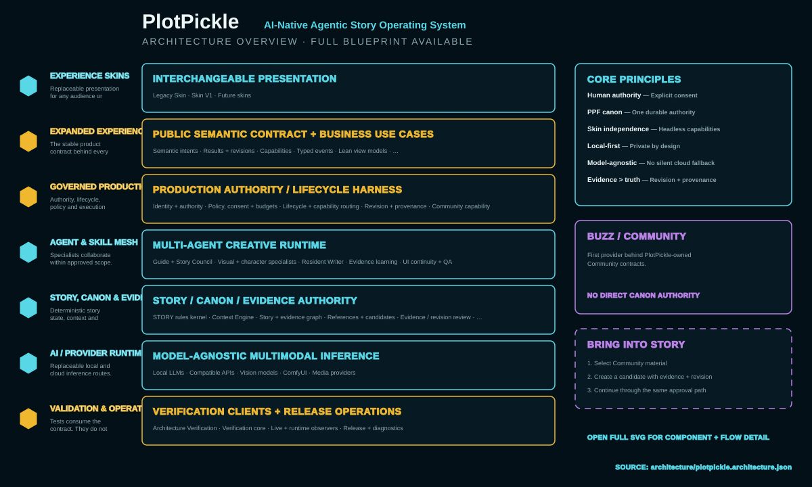

<p align="center">
  
</p>

<h1 align="center">PlotPickle</h1>

<p align="center"><strong>Learn the craft. Make the decisions. See the story take shape.</strong></p>

<p align="center">Local-first · Writer-controlled · Visual story shaping · AI optional · BUZZ-connected</p>

PlotPickle is a visual writing and creative-direction studio for people who want to shape a story from idea to screenplay to screen without giving away creative authority to an AI model.

It combines writing education, story planning, visual development, screenplay work, review, playable-story systems, local or cloud AI connections, Community/BUZZ collaboration, and a portable PlotPickle Project File (PPF) in one application.

**The Human remains the author.** AI can explain, suggest, draft, visualize and test ideas, but generated material does not silently become story canon.

## Get PlotPickle

### Windows — recommended for testers

1. Open the repository **Releases** page.
2. Download the newest **`PlotPickleSetup.exe`**.
3. Double-click the installer.
4. Launch **PlotPickle** from the Start Menu or the optional Desktop shortcut.

The Windows installer includes the PlotPickle runtime. Testers do **not** need to install Git, Node.js, npm, Rust or open a command window.

PlotPickle installs the application under your Windows user profile and keeps your projects, profile, settings and local runtime data separately so normal upgrades or uninstall/reinstall do not erase your stories.

> During pre-release testing, `PlotPickleSetup.exe` may also be supplied as a verified GitHub Actions artifact before it is attached to a public Release.

### First launch

On first launch:

- create or unlock your local Human profile;
- open the bundled Afterglow example or create/import a story;
- visit **Settings** to connect only the AI services you actually want;
- use PlotPickle without optional BUZZ, Ollama or ComfyUI if you prefer;
- open **Settings → Help** for keyboard shortcuts and the Helper directory.

There is no required paid AI provider and no silent local-to-paid-cloud fallback.

## What PlotPickle does

### Learn

PlotPickle includes an 81-lesson writing curriculum. LEARN teaches the craft in the same application where you apply it, with Sage Brinewick available as a curriculum-grounded guide.

### Plan

PLAN turns learning and story ideas into explicit, reviewable decisions. Answers stay provisional until the writer accepts them.

### Build

BUILD shows what the current story actually supports and turns approved decisions into visual development work.

The BUILD studio now keeps the production path discoverable in one place:

**Story Coverage → Story Workflow → Wireframe → Storyboard → Previs → Render Plan**

### Storyboard, Previs and Render Plan

PlotPickle uses a predictable feature-film scaffold without forcing the writer to think in API calls or frame math:

**24 Story Blocks → 96 Mini-Blocks → 2,400 technical 3-second render clips**

Each 5-minute Block contains four 75-second Mini-Blocks. Each Mini-Block maps to 25 fixed 3-second generation slots when it reaches Render Plan.

Storyboard and Previs remain creative tools. The render grid is production plumbing: a nine-second creative camera move can span three technical clips while remaining one creative intention.

That gives every generated clip a stable address and allows surgical regeneration instead of rebuilding an entire scene because one three-second result failed.

### Write and Edit

Writing and editing remain connected to the same story structure and project. PlotPickle can work with screenplay-oriented material while preserving story, scene and Block context.

### Feedback and Refine

Feedback is anchored to stable story targets. Human review, diagnostics and optional AI proposals can be compared without automatically changing canon. Refinement remains an explicit Human decision.

### PlotPickle Score

When a story is loaded, PlotPickle can calculate a **PlotPickle Score**: a deterministic 0–100 structural rating backed by five transparent dimensions — **Alignment, Verbosity, Erosion, Progression and Coverage**.

The headline formula uses a geometric mean:

`Score = 100 × fifthRoot(Alignment × (1 − Verbosity) × (1 − Erosion) × Progression × Coverage)`

The score does not ask whether a story was written by a Human or AI. Human-written, AI-assisted, AI-generated and imported stories use the same structural evidence contract. Too little evidence produces **NR / Not Rated** rather than a fabricated quality number.

PlotPickle's mathematical narrative model converts normalized story time into stable addresses:

**runtime → 12 sequences → 24 Story Blocks → 96 Mini-Blocks → production/timecode coordinates**

For a default 120-minute feature, the canonical coordinates correspond to 5-minute Blocks and 75-second Mini-Blocks. These are **normalized structural addresses, not creative handcuffs**: scenes and shots may span, compress or cross those regions as the story requires.

This makes structural feedback locatable. Rather than only saying “the middle feels slow,” PlotPickle can identify which Blocks/Mini-Blocks have low progression, repeated evidence, unusual narrative load or missing coverage.

> **PlotPickle does for narrative structure what timecode does for film: it gives creative material a precise address.**

The mathematics provide the coordinate and measurement layer; they do not replace Human creative judgment. The full contracts are documented in [PlotPickle Score](docs/architecture/PLOTPICKLE-SCORE.md) and the [PlotPickle Mathematical Narrative Model](docs/architecture/PLOTPICKLE-MATHEMATICAL-MODEL.md).

The 24/96 coordinate system, PPF integration, technical render addressing, and PlotPickle Score application are documented as **PlotPickle-specific design by Bryan Harris**. Standard mathematics, screenplay structure traditions, timecode, sequence/beat methods and editing metrics remain acknowledged as established prior practice.

### STORY: The Unwritten

STORY: The Unwritten is PlotPickle's reusable playable-story engine. Its purpose is to let creators build stories that can be played, changed and eventually populated by bounded AI characters without creating a second PlotPickle authority system underneath the game.

The current engine foundation is headless and deterministic. It can run a five-scene story, validate player actions, resolve creator rules and consequences, handle victory/loss/endings, save and resume sessions, preserve accepted event history and checkpoints, persist sparse character state/memory/relationships, store admitted Story Pieces with provenance, protect knowledge partitions, hydrate only the active scene working set, and route selected completed-session outcomes through the existing PPF canon proposal boundary.

The governing rule is simple: **AI may propose or interpret; deterministic STORY code decides mechanical state changes.** Generated material does not become accepted session state or durable PPF canon merely because a model produced it.

STORY also keeps world scale separate from inference scale: **stored is not loaded; loaded is not active; active is not running inference.** A large world therefore does not imply that every character becomes a live agent or enters memory at once.

The dedicated creator controls, Game Validator, bounded AI-character execution and first-class STORY workspace are still in active development. The README describes those as upcoming work rather than presenting them as shipped UI.

Wyrmwood remains PlotPickle's first-party teaching game and proving ground. STORY is the reusable engine beneath future playable-story experiences; Wyrmwood is not being rewritten first. BUZZ remains the social/discovery layer and may launch STORY sessions later, but BUZZ does not own authoritative game state. PPF remains the durable canon authority.

## Community, BBS and BUZZ

### Community and BUZZ

<p align="center">
  
</p>

PlotPickle Community uses BUZZ for signed rooms, Communities, membership, presence and conversation.

PlotPickle does **not** automatically upload your screenplay, PPF, local files, prompts, credentials or private story work. Sharing into a Community is an explicit action.

## PlotPickle Nodes, Human profiles, Stewards and BUZZ

A PlotPickle Node is one installation/device. Human profile identity, Node identity and Agent/Steward identity remain separate so Community membership never grants access to another person's local files, models, GPU or services.

BUZZ carries signed Community conversation, membership and presence. The PPF remains the creative authority, and optional remote compute is a separately configured service boundary rather than peer compute from Community members.

## AI: use it, bring your own, or do not use it

Settings separates the important questions:

1. **What capability do you need?** Writing/reasoning, images, video or tools.
2. **Where should it run?** This computer, a private server or cloud.
3. **How should PlotPickle connect?** Local runtime, provider API, OpenAI-compatible API or another supported connection.
4. **Which provider/model should perform the work?**

Local text/model runtimes can include Ollama, LM Studio, llama.cpp and other OpenAI-compatible endpoints. Local image/video workflows can use ComfyUI. Optional cloud/BYOK providers remain separately configured and require the existing consent boundaries for paid work.

## One story authority

The PPF is PlotPickle's canonical creative record.

That means:

- the writer owns final creative decisions;
- AI output is proposal material until accepted;
- Storyboard and Previs cannot silently rewrite upstream story canon;
- STORY session state is not a second canon store;
- completed STORY outcomes can propose canon changes, but only the existing PPF admission path can make them durable canon;
- BUZZ conversation does not become canon automatically;
- deterministic tests remain product-quality evidence, not creative authority.

<!-- PLOTPICKLE:UPDATES:START -->
## UPDATES

Current living architecture: **v1.0 · TARGET · source updated 2026-09-09**  
Fingerprint: `sha256:b69cb4723228cf791db0c79ac909cae3ef1f91940c3168756832c8ac8bcf2518`

- Architecture status: **TARGET** — 7 canonical layers from one machine-readable map.
- Documentation freshness: **CURRENT generated surfaces; Human architecture prose remains REVIEW-owned**.
- Agent Context: **CURRENT**.
- C4 freshness: **CURRENT**.
- Current map summary: Community entry + monochrome presentation merged. Full Community contracts, versioned Skin adapters and Bring into Story remain migration work.

Inspect the living evidence: [Architecture Knowledge Map](architecture/plotpickle.architecture.json) · [Architecture Documentation](architecture/README.md) · [Documentation Drift Detection](docs/updates/documentation-drift.md) · [Agent Context](docs/architecture/agent-context.md) · [C4 Diagrams](architecture/plotpickle-c4.md).

Previous current entries are preserved in [UPDATES history](docs/updates/README.md), not accumulated in this README.
<!-- PLOTPICKLE:UPDATES:END -->

<!-- PLOTPICKLE:ARCHITECTURE:START -->
## ARCHITECTURE

PlotPickle's architecture is generated from one machine-readable source: [`architecture/plotpickle.architecture.json`](architecture/plotpickle.architecture.json). The application Skins do not own this documentation style; architecture diagrams use their own dedicated Architecture Skin.

The README intentionally shows a compact overview. **[Open the full-resolution Architecture Blueprint](architecture/plotpickle-architecture.svg)** for component-level detail, authority boundaries and flows.

<p align="center">
  
</p>

| Layer | Boundary | Responsibility |
|---:|---|---|
| 1 | EXPERIENCE SKINS | Replaceable presentation for any audience or device. |
| 2 | EXPANDED EXPERIENCE LAYER | The stable product contract behind every Skin. |
| 3 | GOVERNED PRODUCTION ORCHESTRATION | Authority, lifecycle, policy and execution control. |
| 4 | AGENT & SKILL MESH | Specialists collaborate within approved scope. |
| 5 | STORY, CANON & EVIDENCE CORE | Deterministic story state, context and durable canon. |
| 6 | AI / PROVIDER RUNTIME | Replaceable local and cloud inference routes. |
| 7 | VALIDATION & OPERATIONS | Tests consume the contract. They do not run the product. |

BUZZ is the first provider behind PlotPickle-owned Community contracts. Community material has no direct canon authority. The governed bridge remains: **Community material → Bring into Story → Candidate → Evidence / Revision → Human approval → PPF Canon**.

To regenerate both diagrams and this managed section after an architecture change, run `node architecture/generate-architecture.mjs`. CI runs `node architecture/generate-architecture.mjs --check` so the JSON source, full blueprint, README overview and managed README section cannot silently drift apart.
<!-- PLOTPICKLE:ARCHITECTURE:END -->

## The default feature-film production model

| Layer | Plain-English meaning | Default duration | Count |
|---|---|---:|---:|
| Feature | Complete default movie scaffold | 120 minutes | 1 |
| Story Block | Major story chapter | 5 minutes | 24 |
| Mini-Block | Controlled story/visual sequence | 75 seconds | 96 |
| Render clip | Technical generation slot | 3 seconds | 2,400 |
| Shared clip boundary | Start/end continuity anchor | — | 2,401 |

The 2,400 clip slots are deterministic addresses, not 2,400 records that must be generated up front. PlotPickle derives the grid and persists real production work as the Human plans or generates it.

## Keyboard navigation

PlotPickle supports single-letter workspace navigation when focus is not inside an input, editor, control or dialog.

The interface intentionally does not print those letters under every navigation icon. Open **Settings → Help → Keyboard navigation** for the current command map.

## Data and privacy

PlotPickle is local-first.

Projects and profile-owned data remain on the user's machine unless the Human deliberately invokes an external provider, backup/sync feature or Community share.

Credentials do not belong in PPF story files. Community presence does not make another person's computer available as compute. Optional remote compute is a separately configured service boundary.

## Optional companions

PlotPickle can connect to optional services, including:

- **BUZZ** for Community, signed rooms and presence;
- **Ollama / LM Studio / llama.cpp** for local writing models;
- **ComfyUI** for local image/video workflows;
- configured cloud/BYOK providers for capabilities the user explicitly chooses.

Core PlotPickle should still open and remain useful when those optional services are unavailable.

<!-- PLOTPICKLE:OSS:START -->
## Built with open source

PlotPickle is an open-source project built on, connected to, developed with, and materially informed by a wider open-source ecosystem. We want both the software and the ideas that genuinely contributed to the current product to remain visible.

The canonical machine-readable inventory is [`config/third-party-oss.json`](config/third-party-oss.json). It records how each system is used, its upstream source, licence evidence, pinned/user-managed version status, current evidence paths and any retained notice. `package.json` and `package-lock.json` remain the authoritative complete npm dependency graph, including transitive packages; the public-readiness audit checks that graph against this registry.

| Open-source system | How it contributes to PlotPickle | Licence |
|---|---|---|
| Node.js | Bundled Windows application runtime | MIT, plus upstream third-party notices |
| React | Primary UI runtime | MIT |
| Vite | Build/local application runtime | MIT |
| Vinext | Next-compatible application runtime | MIT |
| Mastra | Bounded agent/orchestration runtime | Apache-2.0 |
| Vercel AI SDK | Provider-neutral AI runtime primitives | Apache-2.0 |
| Drizzle ORM | Data/database tooling | Apache-2.0 |
| libsodium / libsodium-wrappers-sumo | Authentication/profile cryptography | ISC |
| BUZZ | Optional Community, signed rooms and presence | Apache-2.0 |
| Ollama | Optional user-managed local model runtime | MIT |
| llama.cpp | Optional user-managed local model runtime | MIT |
| ComfyUI | Optional user-managed local image/video workflow runtime | GPL-3.0 |
| FFmpeg / ffprobe | Optional user-managed local media measurement for Sequence Evidence; not bundled | LGPL-2.1-or-later by default; some builds are GPL-2.0-or-later |
| Lazy Frames | Optional reviewed local animatic tool | MIT |
| Portless | Developer endpoint/runtime tooling | Apache-2.0 |
| Pi coding agent | Optional external developer/repair worker | MIT |
| Cline | Optional external developer/repair worker | Apache-2.0 |

### Open-source ideas and workflows we adapted

These projects are not presented as PlotPickle runtime dependencies. They are acknowledged because their current OSS work materially informed a PlotPickle methodology, architecture decision or reviewed workflow. PlotPickle keeps explicit evidence markers in the current architecture documents so this list cannot silently drift.

| Open-source reference | How it informed current PlotPickle | Licence |
|---|---|---|
| ReelBench Skills | Inspired the Sequence Evidence split between machine-measured facts, bounded model annotation and deterministic validation | Apache-2.0 |
| BERD | Architectural reference for managed sidecars, pinned runtimes, lifecycle checks and validation patterns | Apache-2.0 |
| GitHub Spec Kit | Reference for PlotPickle's repository-native spec-driven development discipline and post-build convergence check | MIT |
| Lightricks ComfyUI-LTXVideo pinned workflow | Source/reference for the reviewed single-stage LTX proof graph at the recorded upstream revision | Apache-2.0 at the pinned source revision |
| ComfyUI LTX-Video workflow template | Reference for the reviewed text-to-video LTX graph adaptation | MIT |

Evaluation-only or future candidates are deliberately **not** presented as contributors merely because they appear in an issue or architecture discussion. They enter this acknowledgement only when their work materially influences current PlotPickle and the same change adds an auditable `PLOTPICKLE:OSS-INFLUENCE:<registry-id>` declaration.

PlotPickle also supports reviewed third-party model/assets under their own terms. For example, the optional SDXL Base 1.0 starter is pinned and verified under its OpenRAIL++ terms. A connection being supported does **not** mean it is open source: LM Studio and configured proprietary/cloud/BYOK providers are deliberately excluded from the OSS tables rather than being mislabelled.

For licence scope and retained notices, see [`LICENSES.md`](LICENSES.md), [`NOTICE.md`](NOTICE.md), the full npm lockfile and the paths recorded in the canonical registry. Third-party names and trademarks belong to their respective owners; acknowledgement does not imply endorsement or sponsorship.
<!-- PLOTPICKLE:OSS:END -->

## Run from source

The installer is the normal path for testers. Developers can run the repository directly.

### Requirements

- Node.js **22.13 or newer**;
- Git;
- a supported desktop browser for development.

### Development

```bash
git clone https://github.com/BryanHarrisScripts/PlotPickle.git
cd PlotPickle
npm ci
npm run dev:local
```

### PlotPickle Development Loop

Non-trivial product and architecture work follows the repository-native loop:

**IDEA → ASSESS → DEVELOPER BRIEF → ISSUE → PLAN → BUILD → TEST/FIX → CONVERGE → PR GATES → MERGE**

`AGENTS.md` is the project constitution. Convergence checks that the finished diff and evidence satisfy the promised acceptance criteria; PR Gate and Product Gate then independently prove the tested head is healthy. See [`docs/architecture/PLOTPICKLE-DEVELOPMENT-LOOP.md`](docs/architecture/PLOTPICKLE-DEVELOPMENT-LOOP.md).

### Production verification

```bash
npm test
npm run build
```

### Build the Windows package

```bash
npm run package:windows
```

The release workflow additionally builds and exercises the native Windows launcher and `PlotPickleSetup.exe` on a Windows GitHub runner.

## Repository map

- `app/` — product screens, application shell and UI runtime
- `core/` — canonical contracts, project authority and core storage/security boundaries
- `modules/` — product-domain implementations such as LEARN, PLAN, BUILD, Wyrmwood and STORY: The Unwritten
- `lib/` — shared domain/runtime capabilities
- `learn/` — curriculum content
- `tests/` — deterministic product and architecture contracts
- `docs/` — architecture, developer briefs, audits and historical design material
- `scripts/` — developer, verification and packaging tooling

## Documentation

Useful starting points:

- [Writing and Production](public/docs/readme/WRITING-AND-PRODUCTION.md)
- [PlotPickle Product Contract](docs/PLOTPICKLE-PRODUCT-CONTRACT.md)
- [PlotPickle Score](docs/architecture/PLOTPICKLE-SCORE.md)
- [PlotPickle Mathematical Narrative Model](docs/architecture/PLOTPICKLE-MATHEMATICAL-MODEL.md)
- [STORY: The Unwritten architecture](docs/story-the-unwritten.md)
- [Structure Engine](docs/architecture/structure-engine.md)
- [Authentication threat model](docs/architecture/PLOTPICKLE-AUTH-THREAT-MODEL.md)
- [Developer documentation](docs/developer/)

## Project status

PlotPickle is actively developed and is entering real-user testing. STORY: The Unwritten now has its deterministic rules kernel and sparse persistence/canon foundation in place; creator controls, validation, bounded character agents and the dedicated playable workspace remain active development work.

The current product priority remains getting the Windows application into testers' hands, observing real workflows and using that evidence to drive the next architecture and performance decisions.

Issues and pull requests are tracked in this repository. If you find a confusing workflow, visual inconsistency, failed install, lost navigation path or reproducible bug, please capture the steps and environment so it can become a deterministic product fix.

## License

PlotPickle is licensed under **AGPL-3.0-or-later**. See [LICENSE](LICENSE).