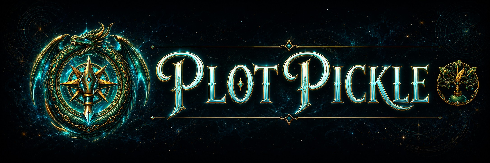
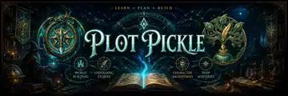
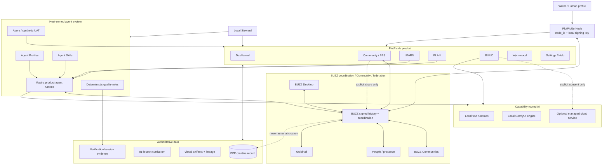

<p align="center">
  
</p>

<h1 align="center">PlotPickle</h1>

<p align="center"><strong>Learn the craft. Make the decisions. See the story take shape.</strong></p>

<p align="center">Local-first · Writer-controlled · Visual Writer · Agent-assisted · BUZZ-connected · Self-verifying</p>

PlotPickle is a local-first creative studio for writers, artists and AI tinkerers. It combines a structured writing curriculum, editable story planning, visual development, local or bring-your-own AI, a shared Community/BBS, named helper agents and a deterministic verification loop.

The writer remains the author. AI can explain, draft, visualize, test and suggest, but it does not silently turn generated material into story canon.

The current product spine is:

**Dashboard · Community · LEARN · PLAN · BUILD · Wyrmwood · Settings**

The core creative progression is:

**LEARN → PLAN → BUILD**

PlotPickle currently implements that progression through **Foundations** and **World**. Character is the next Visual Writer frontier. The complete 81-lesson curriculum remains available; later groups stay gated until their vertical slices are deliberately implemented.

<p align="center">
  
</p>

## The Visual Writer

PlotPickle is organized around one shared progression engine rather than a pile of disconnected tools.

### LEARN

LEARN is the curriculum and teaching room. The writer navigates the lesson library on the left, reads and works in the centre, and can ask **Sage Brinewick**, the Lorekeeper, for curriculum-grounded help on the right.

The curriculum is the source for what each writing group teaches. Progression is explicit: later work does not become available merely because a user discovers a URL or button.

### PLAN

PLAN turns completed learning into editable story decisions. Answers remain provisional until the writer accepts them. PlotPickle stores those decisions in the project/PPF authority model rather than hiding them inside a chat transcript.

Foundations and World use the same canonical progression/output engine. World begins only after the accepted Foundations frontier.

### BUILD

BUILD turns accepted decisions into reviewable visual story artifacts.

The current Visual Narrative Wireframe is intentionally rough and revision-aware. Foundations establishes the first visual frontier. World can then add, revise, retain or supersede only the frames materially affected by accepted worldbuilding decisions. Earlier accepted history and lineage are preserved instead of being silently overwritten.

Generation is provider-agnostic. PlotPickle can use the configured local image route, including the managed local ComfyUI engine. A paid/cloud route requires explicit acknowledgement; a failed local route never silently becomes a paid request.

## One workspace language

PlotPickle uses a shared three-column workspace on normal desktop screens:

- **19% left** — navigation, curriculum, rooms, categories or server context;
- **56% centre** — the active lesson, plan, build surface, game or conversation;
- **25% right** — agent, commands, help, status or contextual guidance.

The layout collapses deliberately on small screens instead of allowing individual workspaces to invent unrelated page structures.

Community/BBS follows the same contract: live BUZZ server/caller/presence on the left, active BBS content in the centre, and keyboard commands/context on the right.

## Community, BBS and BUZZ

PlotPickle Community is a writer-friendly interface over **BUZZ**, the signed messaging, Communities, rooms, membership, presence and coordination layer.

The built-in **PlotPickle Community BBS** provides the Great Hall, Story Rooms, People, Agents & Stewards, Review Queue and Guildhall while keeping the user inside the same PlotPickle shell. A verified BUZZ user may also create additional BUZZ Communities. PlotPickle should surface public, closed/invite-only and private Communities according to the connected BUZZ visibility and membership policy rather than maintaining a second social database.

The primary discovery model is **Communities + people**. Node identity stays underneath social activity as device/install provenance for trust, audit and moderation; ordinary users do not browse other people's machines as resource providers.

In Community, the value labelled **NODE** remains the real connected BUZZ community/node name where that network context is shown. That display value is not the cryptographic `node_id` of the local PlotPickle installation, and it does not imply access to another installation's hardware or services.

### One conversation, two clients

PlotPickle and BUZZ Desktop are two clients over the **same signed BUZZ room history**. They do not maintain competing copies of Community chat. The BUZZ signed room history remains the authoritative Community conversation record shared by those clients.

If a writer intentionally posts a Great Hall or Story Room message from PlotPickle, BUZZ Desktop reads that same BUZZ event. A message posted from BUZZ Desktop is read back by PlotPickle from the same room history. BUZZ event IDs provide the reconciliation identity.

This does **not** mean PlotPickle automatically uploads creative work. LEARN answers, PLAN decisions, BUILD artifacts, PPF state, drafts, local files, provider prompts and credentials remain local unless the writer explicitly shares content into a Community destination.

### User-created Communities

A BUZZ Community is its own social/security object, not a PlotPickle Node. Depending on BUZZ policy it may define an owner/admin/moderator set, public/closed/private visibility, membership/join rules, rooms/channels, Community rules, signed presence and moderation state.

Public Communities may expose safe public discovery metadata. Closed/invite-only Communities protect room content until the Human is authorized. Private/non-discoverable Communities stay invisible to unauthorized Humans. Revoked membership and stale presence are never presented as current.

### BBS Moderator

**Merrin Bellwarden** is the Community BBS Moderator. Merrin is designed as an owner-approved BUZZ-managed identity with its own signing identity and Great Hall membership. A normal greeting such as “hi” or “hello” can receive a natural welcome without requiring an @mention.

Merrin is a host and conversational guide, not an autonomous enforcement system. Public-room memory is bounded; private Story Rooms and PPF project state are outside the Moderator’s default read scope. Merrin cannot ban users, alter story canon, change code or write GitHub state.

BUZZ Desktop remains the owner-level interface for creating/approving managed BUZZ identities and advanced BUZZ administration. PlotPickle reports real identity/presence state rather than pretending an unapproved agent is online.

## PlotPickle Nodes, Human profiles, Stewards and BUZZ

A **PlotPickle Node is one uniquely identified PlotPickle installation/device**. The Node owns a durable `node_id` and an independent local signing keypair. A Person may use several Nodes, and a shared household Node may securely host several local Human profiles.

PlotPickle owns Human-profile authentication; the operating system and BUZZ are not login authorities. The canonical security assumptions, cryptographic envelope boundary, profile registry, access modes, authorization context and key lifecycle are documented in [PlotPickle Auth threat model](docs/architecture/PLOTPICKLE-AUTH-THREAT-MODEL.md), [PlotPickle Auth cryptographic dependency selection](docs/architecture/PLOTPICKLE-AUTH-CRYPTO-SELECTION.md), [PlotPickle Auth Core](docs/architecture/PLOTPICKLE-AUTH-CORE.md), and [Profile Master Key vault](docs/architecture/PLOTPICKLE-PROFILE-VAULT.md).

The **Steward is the local caretaker inside that Node**. The Steward can monitor health, coordinate agents, explain what is happening and help recover local services, but it is not the Node identity itself.

Human/Avatar identity, Node identity and Agent/Steward identity remain separate:

```text
Person / Avatar A
      +-- PlotPickle Node A
      +-- PlotPickle Node B

Shared household Node C
      +-- Human profile A -> private vault + Human BUZZ identity
      +-- Human profile B -> private vault + Human BUZZ identity
      +-- Guest profile   -> isolated workspace
```

A Human using two Nodes remains one person in Community. Two Humans sharing one Node remain two people with separate private workspaces and BUZZ identities. Switching Humans is a security boundary: project/vault access, agent and retrieval context, private UI state, credentials and the previous Human's BUZZ session must be cleared/released before another profile unlocks.

BUZZ has two bounded roles. Inside one Node it is the local coordination/evidence backbone for agents, health, recovery and verification. Between people it carries signed Communities, rooms, membership, conversation, presence and Node provenance.

**Community presence is never compute eligibility.** Other people do not receive or use this Node's GPU, models, ComfyUI, BERD, filesystem, storage, agents, provider credentials or build/test capacity merely because they can see the Human in BUZZ.

Local AI/media/build capabilities remain private to the Node's own local capability manifest. Any future remote compute uses a separately configured **managed cloud service/farm**, never another Community member's PlotPickle installation. Scoped cloud work retains explicit target selection, data minimization, expiry, provenance, candidate-only results and explicit paid consent; there is no silent local-to-cloud fallback.

Terms such as `desktop`, `studio-host`, `compute` and `hybrid` describe deployment/readiness of an installation; `local`, `lan` and `internet` describe endpoint reachability. They are not Human identity classes and they do not opt a machine into peer resource sharing.

## Agents and helpers

PlotPickle’s helper identities come from host-owned Agent Profiles. Names, responsibilities, capability requests and authority boundaries are not redefined separately by each screen.

Settings → Help provides a plain-language **Meet the Helpers** directory. Non-Sage helpers use the current 16-bit full-body fantasy/lore portrait system in circular teal/gold medallions. Sage keeps the established approved portrait and guide presentation.

| Helper | Role | Purpose |
|---|---|---|
| Sage Brinewick | Lorekeeper | Curriculum-grounded LEARN mentor and story guide |
| Tamsin Hearthquill | Keeper of Foundations | Turns learning into reviewable PLAN decisions |
| Master Oaken-Vague | Keeper of the Wyrmwood | Creates curriculum-bound Wyrmwood challenges |
| Rowan Scalequill | Arbiter of Lessons | Evaluates Wyrmwood responses against the lesson |
| Quillan Reedcloak | Story Scribe | Coordinates creative specialist options |
| Elowen Mapweaver | Cartographer of Beats | Maps structure, causality, stakes and story progression |
| Mira Threadmere | Threadkeeper | Protects accepted continuity and surfaces conflicts |
| Critics’ Circle | Independent Story Review | Pressure-tests story clarity and audience experience |
| The Marquee Director | Key Art & Trailer Director | Develops reviewable campaign-image and trailer concepts |
| Luma Glassfern | Lantern Warden | Read-only rendered visual observer |
| Orin Ledgerbark | Archivist of the Hall | Searches approved Guildhall history and receipts |
| Merrin Bellwarden | BBS Moderator | Welcomes and helps callers in public Community conversation |
| Avery North | The Wayfarer | Synthetic first-time writer used for product UAT |
| Bram Gatewick | Gatewarden | Represents deterministic quality gates |
| Rook Ironquill | Forgekeeper | Coordinates verified developer repair handoffs |
| BEN | Code-quality reviewer | Finds maintainability and discoverability regressions |
| Fen Copperwind | Herald of the Forge | Produces verified GitHub-ready engineering handoffs |

An agent’s personality does not grant authority. PPF remains creative authority, deterministic tests remain PASS/FAIL authority, and GitHub remains code/PR/merge authority.

## Avery and Writer-in-Residence

Avery North is a disclosed synthetic first-time writer used to exercise PlotPickle through visible UI behavior.

Avery now travels across Dashboard, Foundations and World LEARN/PLAN/BUILD, Wyrmwood and Settings. Session evidence is persisted locally for review. Dashboard shows exactly four Writer-in-Residence session slots; filled sessions open an in-app review, while unavailable POSTER/TRAILER actions remain visibly disabled rather than pretending an artifact exists.

Avery does not receive hidden DOM/source/localStorage shortcuts to “pass” the product. Deterministic UAT remains authoritative.

## Local-first AI

PlotPickle routes AI by capability rather than hard-wiring the product to one model or inference application.

Local text/model endpoints can include:

- Ollama;
- LM Studio;
- llama.cpp;
- other OpenAI-compatible local endpoints.

Optional cloud/BYOK providers can sit behind the same routing boundary when the user explicitly configures them.

Model families such as Qwen or DeepSeek are models, not runtimes. The hardware-aware layer can recommend appropriate models/quantization for the machine rather than assuming every computer can run the same stack.

### Local ComfyUI engine

ComfyUI is PlotPickle’s local node-based creative-compute option for image workflows.

PlotPickle can use a reviewed managed ComfyUI instance headlessly and can reuse shared model paths from an existing ComfyUI Desktop installation. Desktop remains useful for inspecting and editing workflows, but PlotPickle startup does not wait for the Desktop UI.

User-facing status distinguishes the important facts instead of collapsing them into one ambiguous “connected” state: **Installed · Running · Model ready · Test needed · Active**.

The default local ComfyUI endpoint is loopback-only (`127.0.0.1:8188`) unless the user deliberately configures something else.

## Settings and provider setup

Settings owns AI routing, provider credentials, BUZZ connection, local runtime health and Help.

Provider setup links open the actual provider configuration section instead of bouncing back to the Settings landing page. Hybrid routes such as Ollama + ComfyUI expose both owners separately.

Credentials are kept outside story/PPF project files. PlotPickle does not silently migrate credentials, BUZZ identity keys or private project data into committed source.

## How the architecture fits together



The important boundaries are simple:

- **Writer / Human profile** — final creative decision maker and private-workspace owner.
- **PlotPickle Node** — one installation/device with its own durable signing identity.
- **Steward** — local caretaker inside the Node; not the Node identity and not an authority shortcut.
- **PPF** — canonical creative record.
- **Curriculum** — teaching authority for LEARN-derived progression.
- **Mastra** — product-agent runtime/orchestration layer.
- **AI providers** — suggestion/generation capabilities, never canon owners.
- **BUZZ** — signed local coordination plus Communities/people/presence/federation fabric; it does not replace local Node identity, expose peer resources or own PPF canon.
- **Managed cloud service** — optional explicit remote compute boundary, separate from Community Nodes.
- **BUZZ Desktop** — companion/owner interface over the same BUZZ network.
- **GitHub** — canonical source, issues, pull requests and merge authority.
- **UAT/BEN/visual observer** — evidence and quality signals, not creative authority.
- **Pi/Cline** — external developer repair workers, not writer-facing product agents.

## Verification and repair

PlotPickle’s normal development rule is: **build, test, fix, merge only when green**.

The verification stack combines focused deterministic regressions, LEARN validation, Community/BUZZ contracts, Hardware-Aware Local AI checks, production builds, focused UAT, Writer-in-Residence evidence and BEN code-quality review.

A failure remains a failure until the actual cause is repaired. Tests are not weakened simply to obtain a green badge.

Pi is an optional bounded repair worker; Cline can be selected as an alternative developer worker. Neither replaces deterministic verification, and neither has independent merge authority.

## Development

Requirements:

- Node.js 22.13 or newer;
- npm;
- optional local AI runtime/models for AI-assisted features;
- optional ComfyUI for local image generation;
- optional BUZZ Desktop for Community administration and managed BUZZ agents.

Install and start the local development application:

```bash
npm install
npm run dev:local
```

Core repository checks:

```bash
npm test
npm run build
```

The Windows startup and Full Verification scripts remain first-class paths for the local desktop workflow.

## Repository principles

PlotPickle is local-first and writer-controlled by default.

- No generated draft silently becomes canon.
- No local AI failure silently becomes a paid cloud request.
- No Community connection automatically uploads the project.
- No Community membership or social trust exposes another Human's Node resources.
- No local capability manifest becomes a peer-compute advertisement.
- No agent personality grants extra permissions.
- No agent grades its own work as the final PASS/FAIL authority.
- No coding worker merges its own unverified change.
- Accepted visual artifacts preserve history and lineage across later revisions.
- Community messages and private creative state remain different data classes.

## What comes next

Foundations and World prove the Visual Writer architecture end to end. Character is the next progression frontier; later curriculum groups can follow the same LEARN → PLAN → BUILD engine without creating parallel stores or one-off workflow rules.

Historical modules still exist in the repository where useful, but they do not become part of the current writer journey merely because old code remains. A returning feature must fit the shared workspace, authority and progression contracts.

## License

PlotPickle is licensed under **AGPL-3.0-or-later**. See the repository license for details.
