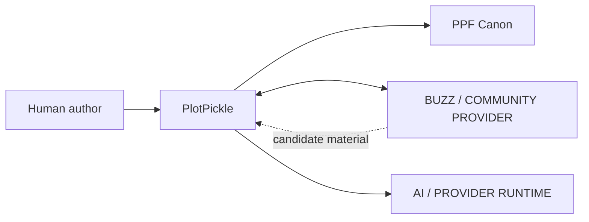
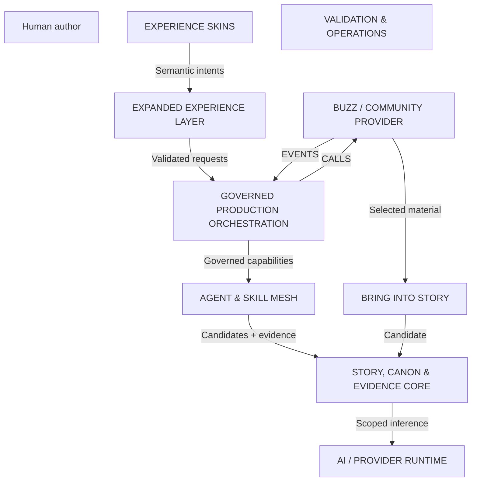
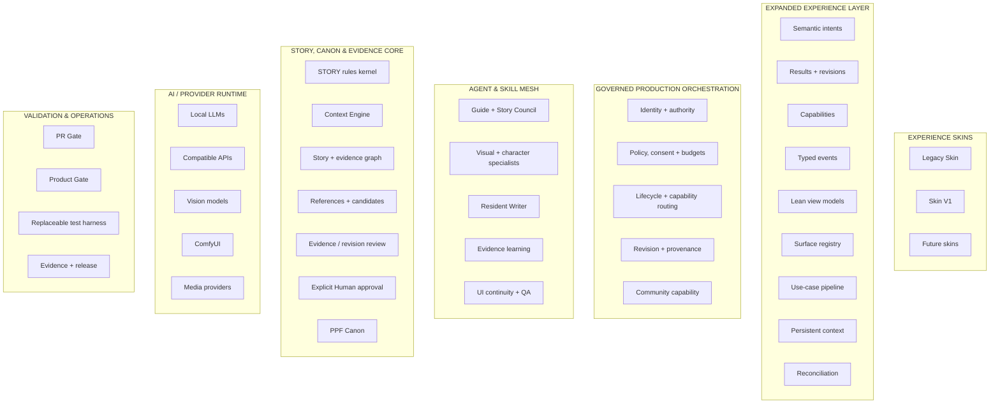

# PlotPickle C4-style Architecture Views

Generated projection of `architecture/plotpickle.architecture.json`. C4 is a view of the canonical map, not a separate model.

Source fingerprint: `sha256:b69cb4723228cf791db0c79ac909cae3ef1f91940c3168756832c8ac8bcf2518`

## System Context

## Container view

## Component view

For exact authority, component detail and migration state, inspect the canonical Architecture Knowledge Map and full architecture blueprint.
