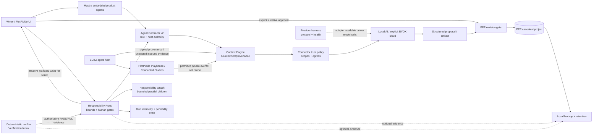
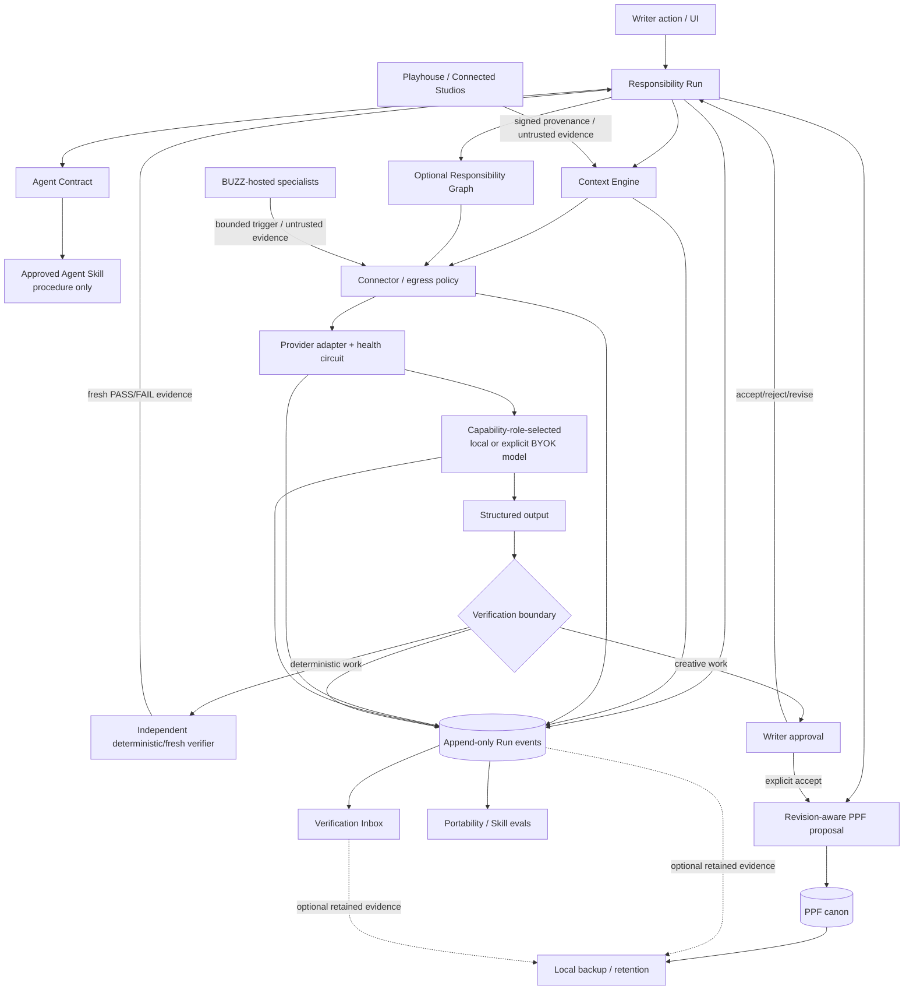

# PlotPickle agent architecture and trust boundaries

**Status date:** 2026-08-18  
**Purpose:** describe the code that exists now, the authority it actually has, and the target wiring as the architecture is adopted across older product paths.

PlotPickle is local-first and writer-authoritative. No diagram below grants authority; the host policy, PPF revision boundary and deterministic verification rules in code remain authoritative.

## Current architecture — implemented foundation

The following foundation is implemented and covered by focused CI. Some older product-agent call paths still invoke their existing Mastra/local-AI gateways directly and have not all been migrated to create Responsibility Runs or emit every telemetry event.

### What “implemented foundation” means

- **Agent Contracts v2:** PlotPickle owns product roles, approved Skill bindings, read/proposal scopes, forbidden authority, verification requirements and creative authority. BUZZ owns mutable BUZZ-hosting concerns such as cryptographic identity, instructions, encrypted memory, ACP harness, provider/model/effort, respond-to rules and BUZZ lifecycle.
- **Context Engine:** creates bounded task packets with explicit source type, trust, authority, allowed use and provenance. BUZZ peers/external tools/observations remain untrusted suggestions.
- **PPF revision gate:** canonical changes carry a base revision and provenance. Stale proposals cannot overwrite newer accepted writer decisions. Creative canon still requires explicit writer approval.
- **Connector trust policy:** direct, MCP, provider-tool, graph-node, code-mode and BUZZ-triggered calls share the same scope/egress policy primitives. Product agents cannot acquire developer/GitHub/shell authority through a tool or Skill.
- **Responsibility Runs:** durable bounded lifecycle, budgets, pause/resume/cancel, deterministic verifier separation and writer-gated creative completion.
- **Responsibility Graph:** structured node contracts, real data dependencies, resource isolation, missing-child checks, layered fan-in and bounded parallelism.
- **Run telemetry/provider/evals:** safe structured events can be appended to the Run event truth; provider adapters/health and portability eval primitives exist. Event-derived UI summaries are available when telemetry has been emitted.
- **BUZZ/Playhouse:** separate collaboration/runtime/federation systems. Signed provenance does not equal trusted instruction or PPF canon.
- **Backup:** complete project backup uses the existing portable PPF as the project payload and may include sanitized Run/Verification evidence. Secrets and BUZZ-owned private data are excluded.

## Target architecture — universal adoption path

The target is not a second rewrite. It is the gradual migration of older call paths through the already-implemented boundaries so every meaningful agent/model/tool action participates in the same Run/event truth.

The target invariant is: **execution capability never implies PlotPickle authority**. A powerful ACP, code-mode, future NOOA sandbox, or developer harness is still bounded by the host contract and cannot promote its own output to canon.

## Authority matrix

| Actor / artifact | May read bounded project context | May call granted tools | May propose creative changes | May mutate PPF canon directly | May authoritatively PASS/FAIL deterministic verification | May use developer/GitHub write authority | Final creative authority |
|---|---:|---:|---:|---:|---:|---:|---:|
| Writer | Yes | Via UI/host actions | Yes | **Yes, through explicit accepted PPF revision/apply flows** | May decide creative acceptance; not a substitute for deterministic machine gates | Only when explicitly acting in developer workflow | **Yes** |
| PPF canonical project | N/A | No | No | Canonical state itself | No | No | Stores accepted writer canon |
| Product agent (Mastra or other host) | Only contracted Context Engine scopes | Only host-granted connector scopes | If Agent Contract permits | **No** | No; worker observation only | **No** | No |
| Deterministic/fresh verifier | Evidence/context required by verification contract | Only verification-scoped tools | Feedback/revision evidence only | **No** | **Yes, only for its contracted deterministic gate** | No | No |
| BUZZ-hosted product/specialist agent | Only through PlotPickle boundary when acting on PlotPickle | Only host-granted scopes | If matching PlotPickle Agent Contract permits | **No** | No unless separately contracted as a verifier | No | No |
| Repair/developer agent | Repository/developer scope only in explicit developer workflow | Developer tools only in that workflow | Code repairs, not story canon | **No** | Cannot override authoritative test results; must trigger fresh rerun | **Yes, only in developer workflow** | No |
| Agent Skill | No authority of its own | **No authority of its own** | Describes procedure only | **No** | **No** | **No** | No |

## Memory and canon boundaries

- **PPF canon:** accepted creative truth.
- **PlotPickle project memory/context:** bounded host-selected evidence/instructions; memory is not automatically canon.
- **BUZZ memory:** BUZZ-owned private working/relationship memory. It is not PlotPickle project memory and is not included in normal PlotPickle project backup.
- **Agent observations/external/federated content:** untrusted suggestions unless explicitly promoted by the local host/writer.
- **Run telemetry:** operational facts and safe request/context references; it is not creative canon and deliberately excludes credentials/private internal deliberation.

## Skills and future runtimes

Agent Skills are versioned procedures, not permissions. Community/external Skills remain quarantined until host review. A future specialist runtime (for example a sandboxed Python/NOOA worker) should bind through the same Agent Contract, Context Engine, connector policy, Responsibility Run, telemetry and PPF proposal boundaries rather than becoming a new authority plane.
