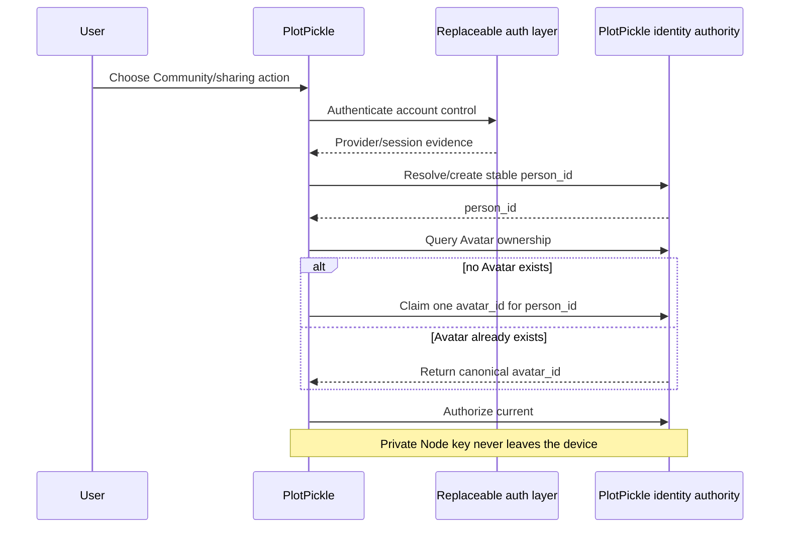
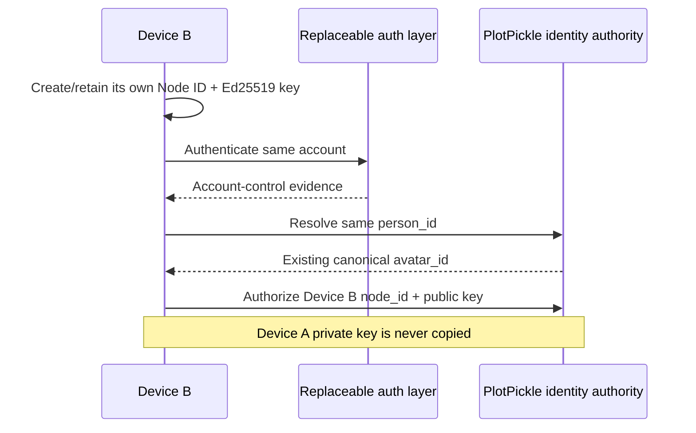
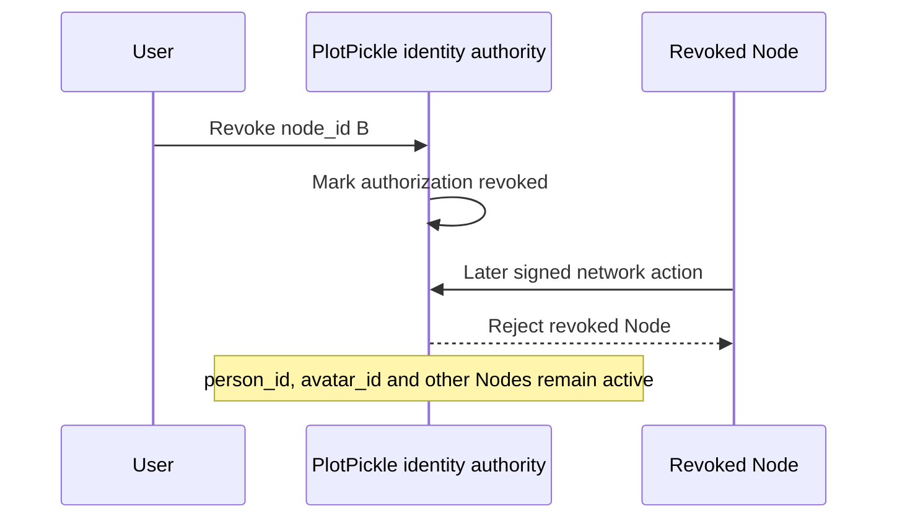

# PlotPickle Identity Authority Contract

Status: Phase A architecture contract for #1071 / #1072. This phase defines identity, cardinality, authority and compatibility only. It does not implement account login, cloud synchronization, mobile UI, public compute or remote BUILD.

## Canonical vocabulary

PlotPickle uses five distinct concepts. None may silently substitute for another.

### Account / Person

`person_id` is the durable PlotPickle-owned account identity. It is the root for account recovery, Avatar ownership and Node authorization.

Authentication providers prove control of an account. They do not own PlotPickle identity. Better Auth, passkeys, email login, social login or a future replacement may supply sessions and authentication evidence, but changing those providers must not change `person_id`.

Authentication-provider subjects are references attached to a PlotPickle account. They are never the permanent PlotPickle identity.

### Avatar

`avatar_id` is the durable public Community persona identifier.

One `person_id` may own exactly one claimed public `avatar_id`. One `avatar_id` belongs to exactly one `person_id`. Display name, portrait, biography and other presentation fields are mutable and are not identity keys.

Public Community moderation, public trust and public reputation attach to `avatar_id`. Account-level enforcement and recovery may additionally attach to `person_id`, but `person_id` does not need to be exposed in public BUZZ messages.

### Node / Device

`node_id` is the durable identity of one PlotPickle installation/device that is authorized to act for an account. One `person_id` may authorize many Nodes. Each Node has its own independent Ed25519 signing keypair.

The Node private key never leaves that Node through PlotPickle sync, PPF, BUZZ, account recovery or device authorization. A second device generates or retains a different keypair.

Node revocation removes that Node's authorization without deleting the owning account, Avatar or other Nodes.

### BUZZ event provenance

BUZZ remains transport and signed provenance. It is not a second human identity authority.

A Community event ultimately represents two facts:

1. `avatar_id` identifies the public persona responsible for the event; and
2. `node_id` plus the Node signature identifies which authorized device signed/sent it.

During compatibility migration, existing BUZZ federation events may still carry `studioId`. That value maps to the signing Node identity as described below. BUZZ must never infer a permanent person identity from a display name, provider account, hostname or local path.

### Compute Node capability

Compute is an optional capability of a Node, not a separate identity class. Advertising text/image/video capability never grants account, Avatar, project, canon, credential or moderation authority. Compute/public availability is explicit opt-in and is not published merely because PlotPickle starts.

## Cardinality contract

The canonical relationships are:

```text
Person 1 ---- 1 Avatar
Person 1 ---- N Authorized Nodes
Node   1 ---- 1 local Ed25519 keypair
Avatar 1 ---- N authorized Nodes acting for it through Person ownership
Node   1 ---- 0..1 active Compute capability advertisement
```

Enforceable database-level intent:

```text
people
  person_id PRIMARY KEY

avatars
  avatar_id PRIMARY KEY
  person_id UNIQUE NOT NULL REFERENCES people(person_id)

node_authorizations
  node_id PRIMARY KEY
  person_id NOT NULL REFERENCES people(person_id)
  signing_public_key UNIQUE NOT NULL
  status CHECK(active | revoked)
  authorized_at NOT NULL
  revoked_at NULLABLE

auth_account_links
  person_id NOT NULL REFERENCES people(person_id)
  provider NOT NULL
  provider_subject NOT NULL
  UNIQUE(provider, provider_subject)

node_capabilities
  node_id REFERENCES node_authorizations(node_id)
  capability
  visibility
  enabled
```

The private signing key is intentionally absent from this shared/account schema because it remains local to the Node.

## Identifier rules

Identifiers are opaque, stable values. Their display labels can change without changing identity.

`person_id` and `avatar_id` are PlotPickle-owned identifiers. Their exact generation mechanism belongs to the implementation phase, but provider subjects must never be reused as either identifier.

`node_id` accepts the existing immutable Studio identifier as a valid compatibility value. Existing `pp_studio_XXXXXXXX` values must not be rewritten merely to obtain a prettier `pp_node_...` prefix. The semantic meaning evolves from installation/Studio identity to Node/device identity while the stored identifier and signing key remain stable.

A future implementation may generate a new Node-specific prefix for fresh installations only after every consumer accepts generic Node IDs. Existing `pp_studio_XXXXXXXX` IDs remain valid aliases/identifiers indefinitely where compatibility requires them.

The `id` field in the current #1013 `PlotPickleNodeDescriptor` is a routing/topology descriptor identifier. Today it may be `local-desktop`. It is not yet cryptographic identity and must not be treated as `node_id` until a later phase explicitly binds the topology descriptor to the signing Node identity.

## Authority matrix

| Concern | Authority |
| --- | --- |
| Stable account ownership and recovery | `person_id` |
| One claimed public persona per account | `avatar_id` constrained 1:1 with `person_id` |
| Public Community moderation/trust/reputation | `avatar_id` |
| Device authorization/revocation | `person_id` -> `node_id` authorization relation |
| Network/device action signature | Node Ed25519 key owned only by `node_id` |
| Authentication/session proof | replaceable auth provider linked to `person_id` |
| BUZZ transport/provenance | signed event carrying/mapping Avatar + Node provenance |
| Compute capability | optional Node capability; never identity authority |
| Story canon | existing writer/PPF authority; unchanged by this contract |

## Compatibility with #927 Studio identity

#927 already provides the correct installation-level security primitive:

- immutable `pp_studio_XXXXXXXX` identifier;
- mutable human-facing Studio display name;
- Ed25519 public/private keypair;
- private key stored in PlotPickle's protected local credential store;
- rename changes presentation only, not the identifier or keypair.

Phase A preserves all of it.

Migration rule for an existing installation:

```text
existing StudioIdentity.studioId     -> node_id (same opaque value)
existing StudioIdentity.signing key  -> Node signing key (same keypair, local only)
existing Studio displayName          -> legacy/local device label only
existing Studio shortCode            -> compatibility/display convenience only
```

No migration step may silently regenerate the Studio/Node ID or signing key. Normal upgrades and restarts preserve both.

A second installation does not copy the first installation's private key. It receives its own Node identity/key and becomes authorized to the same `person_id` through the future device-authorization flow.

## Compatibility with #928 BUZZ/Playhouse federation

#928 currently signs `studio.presence`, `studio.withdrawn` and `studio.test` events using the #927 Ed25519 key and includes `studioId` in the signed payload.

That protocol remains valid during migration.

Compatibility interpretation:

```text
legacy event studioId -> signing node_id
legacy event signature -> Node provenance proof
legacy displayName     -> presentation only
```

A future event version may add explicit `avatarId` and `nodeId`. Until then, existing signed `studioId` history remains verifiable and is not rewritten. A compatibility resolver can map the legacy signing Node to its authorized Person/Avatar once an account claim exists.

The public persona, moderation history and trust history move toward `avatar_id`; the device signature remains attributable to `node_id`. This prevents BUZZ from becoming a second human identity database while preserving signed historical evidence.

No account credential, auth-provider token or private Node key belongs in a BUZZ message.

## Compatibility with #1013 Node topology

#1013 defines an installation/capability routing boundary: desktop, studio-host, compute and hybrid Nodes; explicit local/LAN/Internet trust; and capability-based routing.

This identity contract adds meaning beside that topology without changing its runtime in Phase A.

The future binding is:

```text
canonical node_id
    |
    +-- signing identity / authorization state
    |
    +-- one current routing descriptor
         endpoint
         mode
         trust scope
         readiness
         capabilities
         hardware summary
```

Routing power does not grant identity or project authority. A compute-capable descriptor must be authorized as a Node before future remote work can trust its signature, and public compute remains explicit opt-in.

## Authentication boundary

PlotPickle owns identity; the authentication implementation is replaceable.

A provider link may prove that a user controls a PlotPickle account, but these changes must not alter the canonical identity graph:

```text
email -> passkey
social provider A -> provider B
Better Auth -> another session/auth library
```

In every case, `person_id`, `avatar_id`, existing Node authorizations and trust history remain unchanged.

## Security invariants

1. No Node private key is copied to another Node.
2. No private key is stored in PPF.
3. No account credential or auth token is placed in BUZZ messages.
4. No public display name is used as immutable identity.
5. Authentication-provider IDs remain references, not `person_id`.
6. Existing #927 IDs/keys survive normal upgrades/restarts and migration.
7. A second device has a different Node ID/keypair.
8. Revoking one Node does not remove the Person or Avatar.
9. Starting PlotPickle does not auto-publish device identity or compute capability.
10. Compute capability grants no canon, credential, account or moderation authority.
11. BUZZ preserves signed Node provenance without becoming account identity authority.
12. Phase A adds no mobile, web-anywhere or remote-compute runtime.

## Migration plan

Phase A is documentation and regression locking only. Runtime migration occurs in later phases.

Step 1: Preserve current installation identity.
Read #927 `StudioIdentity` exactly as today. Do not rotate the Ed25519 key or rewrite `studioId`.

Step 2: Introduce canonical account records later.
When network sharing is first requested, create/resolve a PlotPickle `person_id` through the chosen replaceable authentication layer.

Step 3: Claim one Avatar later.
If the Person has no Avatar, Phase B may claim a local draft persona as the one public Avatar. If an Avatar already exists, the new device adopts the canonical Avatar rather than creating a second public identity.

Step 4: Authorize the existing installation as a Node later.
Bind the unchanged #927 `studioId` and public key to the Person as `node_id` plus signing key. The private key stays local.

Step 5: Preserve BUZZ history.
Continue verifying legacy `studioId` events. Resolve their signing Node to the claimed Avatar when authorization data exists. Do not rewrite old signatures.

Step 6: Add additional devices later.
Each additional device uses a distinct Node ID/key and an explicit authorization relation to the same Person.

Step 7: Revoke devices independently later.
Mark one Node authorization revoked and reject future signed actions from that Node while leaving the Person, Avatar and other Nodes active.

## Required sequences

### First install, local-only

```mermaid
sequenceDiagram
    participant U as User
    participant P as PlotPickle
    participant C as Local credential store
    U->>P: Install/start locally
    P->>C: Read #927 Studio identity
    alt no identity exists
        P->>C: Create immutable Studio ID + Ed25519 keypair
    else identity exists
        C-->>P: Return same ID + keypair
    end
    Note over P: No account required; no public Avatar claimed; no compute published
```

### First account claim / Avatar claim



### Second device authorization



### Node revocation



### BUZZ send

```mermaid
sequenceDiagram
    participant U as User
    participant P as PlotPickle Node
    participant B as BUZZ
    participant R as Receiving PlotPickle
    U->>P: Send Community message as Avatar
    P->>P: Sign event with local Node Ed25519 key
    P->>B: Event with Avatar provenance + Node provenance
    B->>R: Signed transport event
    R->>R: Verify Node signature and authorization mapping
    R->>R: Attribute public moderation/trust to avatar_id
    Note over B: BUZZ transports/proves provenance; it does not own person identity
```

## Phase boundary

Phase B (#1073) may implement Avatar claim/recovery and cross-device LEARN synchronization against this contract. Phase C/mobile scope is separately governed by the mobile brief and must not be pulled into Phase A. Trusted/public Node discovery, scoped remote compute and web-anywhere dispatch remain later phases.

Any implementation that needs to violate these identity/cardinality/security rules must return to architecture review rather than silently changing the authority model.
