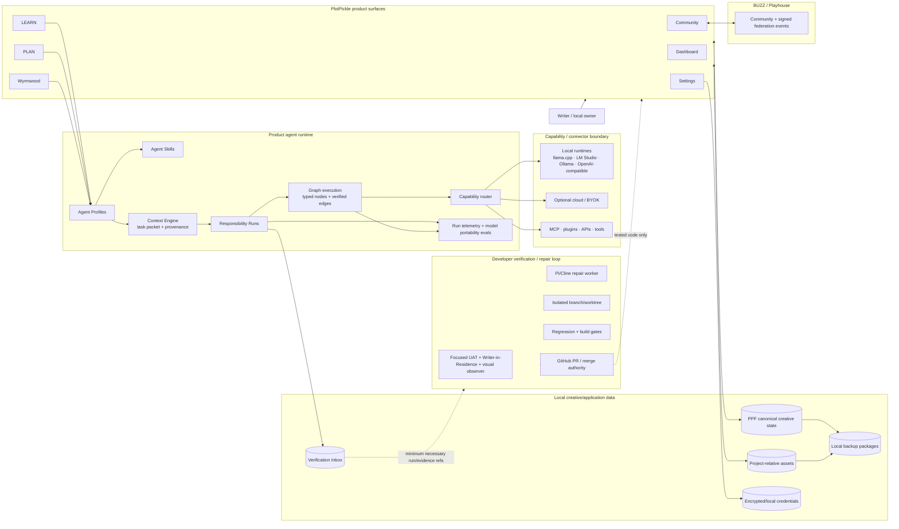

# PlotPickle local-first storage, backup and trust architecture

This document closes the Agent Architecture #962–#969 series. It describes the product that exists now. It does not imply that PlotPickle already provides hosted multi-tenant identity, tenant isolation, or a cloud control plane.

## Current deployment truth

PlotPickle is local-first and server-based/client-capable. The local PlotPickle server owns local application state and exposes sensitive local APIs only to loopback/origin-matched requests. The current local owner/writer is the approval authority for creative changes on that installation.

Connected PlotPickle Studios federate outward through BUZZ/Playhouse signed-event coordination. Federation does not expose another Studio's localhost server and never grants permission to write that Studio's PPF.

A future hosted or multi-user deployment would require an explicit identity, authorization and tenant-isolation design. That is a separate roadmap, not an assumption hidden in the current diagrams.

## Storage engine inventory

PlotPickle deliberately uses simple storage mechanisms where they are sufficient. A database or vector store is not added merely to make the architecture look conventional.

| State | Current mechanism | Authority / notes |
| --- | --- | --- |
| PPF/project data | Integrity-checked `.ppf` JSON files under PlotPickle's local application-data `projects` directory | PPF is canonical creative state. Saves are atomic and existing rolling `.ppf` backups are bounded. |
| PPF revisions/provenance | Revision/provenance structures stored with the project/PPF contract | Accepted creative revisions remain traceable; restore preserves the PPF rather than flattening it. |
| Creative assets | Local files under the application-data `assets` directory plus project-relative asset identity/manifest entries in PPF | Project packages use `assets/...` references, never original absolute machine paths. |
| Curriculum | Repository-bundled curriculum/config content loaded by the LEARN/Context systems | Read-only product content from the writer's perspective. |
| Retrieval/RAG inventory | Current repository/local retrieval structures used by the Context Engine | No separate production vector database is claimed by this architecture. |
| Agent Profiles | Host-owned config/registry files | Identity, role, scope and authority contract; model choice is not agent identity. |
| Agent Skills | `.agents/skills/*/SKILL.md` plus the Skill registry | Procedures only. Skills cannot grant permissions. |
| Project memory | Approved/project-owned memory carried by the Context/PPF provenance contract where present | Untrusted retrieved text never becomes authority merely by appearing in context. |
| Responsibility Runs / graphs | Local application-data JSON Run records with bounded events, child references and graph/run telemetry | Operational state, not creative canon. Ordinary project backup does not copy transient scratch Runs. |
| Run telemetry / model eval evidence | Structured events on the correlated Responsibility Run plus local evaluation/test evidence | No hidden chain-of-thought or credentials. |
| Verification Inbox | Append-only local structured verification records | Operational evidence. It is not bundled into ordinary project backup; it can have a separate evidence export path. |
| BUZZ/Playhouse state | BUZZ signed-event/community layer plus minimum-necessary local receipts | Federation/coordination only; it cannot write PPF. |
| Provider/GitHub/BUZZ credentials | Local credential store under PlotPickle application data, protected by the local credential subsystem | Explicitly excluded from ordinary project backup. |
| Studio signing identity | Separate Studio identity/key material | Explicitly excluded from ordinary project backup. Any recovery flow must be a separate, explicit encrypted export/import design. |
| Local model weights/caches | Runtime-specific local files/caches | Re-creatable machine state; excluded from project backup. |

## Supported project backup package

The local backup service is available only through the local PlotPickle server at `/api/local-backups`.

A `.ppbackup.json` package contains:

- the complete integrity-checked Portable Project File;
- project metadata already carried by the PPF;
- PPF revision/provenance and approved project-owned memory already inside that contract;
- the project-relative creative asset manifest;
- the actual bytes for every asset referenced by the portable manifest;
- SHA-256 checksums for the project payload, every asset and the backup package payload;
- schema/format version and creation time;
- an explicit list of included and excluded record classes.

The package is deliberately self-contained for project recovery. Restore does not require the old machine's absolute filesystem path.

### Ordinary backup exclusions

Ordinary project backup does not include:

- provider API keys or encrypted local credential records;
- BUZZ credentials;
- Studio private signing keys or identity recovery material;
- OS usernames, machine identifiers or old absolute filesystem roots;
- local model weights, model caches or transient runtime caches;
- temporary graph/Responsibility Run scratch state;
- hidden reasoning, scratchpads or private prompts that are not explicit project-owned records;
- full Verification Inbox history.

Verification Inbox data is operational evidence rather than canonical project state and should be exported separately when an owner wants an audit archive.

Studio identity/key recovery is not disguised as a project backup feature. If implemented, it must be a separately invoked encrypted recovery package with explicit owner confirmation.

## Integrity and restore transaction

Restore uses a validate-stage-commit contract:

1. Read the selected backup package under a strict size bound.
2. Validate format/version and the package SHA-256 before changing active state.
3. Re-parse and verify the embedded PPF integrity contract and SHA-256.
4. Decode every bundled asset, verify declared byte size and SHA-256, and verify that every PPF manifest asset is present.
5. Reject unsafe/machine-relative paths and conflicting existing assets before writing anything.
6. Write the project and assets into a private restore staging directory.
7. Re-read the staged PPF and assets and verify them again.
8. Add only missing, checksum-matching assets to the local asset store.
9. Preserve a pre-restore copy of an existing PPF.
10. Atomically replace the project file only after all validation and staging checks pass.
11. Remove the staging directory whether restore succeeds or fails.

A failed integrity/path/conflict/staging check therefore cannot overwrite the existing PPF. An interrupted late restore can at worst leave already-verified additive asset bytes; the canonical project is not replaced until the final commit step.

Missing assets are a hard, plain-language backup/restore error rather than a silently broken story.

## Retention contract

PlotPickle has two backup classes.

Automatic backup packages are bounded by both count and storage budget: at most 10 packages and at most approximately 2 GiB in the automatic package pool. Older automatic packages are pruned first. A single package is also size-bounded, so automatic retention cannot grow without limit.

Manual backup packages are preserved until the owner explicitly deletes them. Manual storage is therefore user-controlled rather than silently pruned. The backup status endpoint reports automatic/manual count, approximate bytes, limits and the last successful backup timestamp/file.

The older rolling `.ppf` save backups remain separately bounded by the local project gateway. They are quick local revision recovery, while `.ppbackup.json` is the machine-independent project-plus-assets recovery package.

Cloud backup is not required. A future optional backup/sync provider must sit behind the connector/provider trust and egress policy rather than bypass it.

## Functional architecture



This diagram describes functional flow. It does not imply that agents, BUZZ, providers or developer tools share authority.

## Trust / authority architecture

```mermaid
flowchart TB
    Owner[LOCAL WRITER / OWNER\nfinal creative approval authority]
    Approval{Explicit human approval gate}
    PPF[(PPF\ncanonical creative authority)]

    subgraph TrustedLocal[Local PlotPickle host]
      Product[Product surfaces]
      Agent[Agent Profiles + Skills\nMastra / Context / Runs / Graphs]
      Policy[Host policy\ncapability + connector + budget gates]
      Secrets[(Encrypted/local secrets store)]
      Evidence[(Verification + run evidence)]
    end

    subgraph External[Connector / provider boundary — untrusted content]
      Tools[MCP / plugins / APIs / providers]
      Cloud[Optional cloud / BYOK]
    end

    subgraph Federated[BUZZ / Playhouse federation boundary]
      Buzz[Signed events / Story Rooms / presence]
      Remote[Other PlotPickle Studios]
    end

    subgraph Developer[Developer / GitHub boundary]
      Test[UAT / visual evidence]
      Worker[Pi / Cline]
      Repo[GitHub code + PR + merge authority]
    end

    Owner --> Product
    Product --> Agent
    Agent --> Policy
    Policy --> Tools
    Policy --> Cloud
    Secrets --> Policy

    Agent -. suggestion / proposal .-> Approval
    Tools -. untrusted result .-> Agent
    Cloud -. untrusted generated result .-> Agent
    Approval -->|approved creative change| PPF
    PPF --> Product

    Product <--> Buzz
    Buzz <--> Remote
    Buzz -. suggestion / coordination only .-> Approval

    Agent --> Evidence
    Evidence -. minimum necessary evidence .-> Test
    Test --> Worker --> Repo

    Tools -.x|cannot grant authority| PPF
    Cloud -.x|cannot grant authority| PPF
    Agent -.x|cannot self-approve canon| PPF
    Buzz -.x|federation never writes canon| PPF
    Remote -.x|no direct localhost access| Product
    Repo -.x|code authority is not creative authority| PPF
```

### Edge legend

| Edge | Meaning |
| --- | --- |
| solid arrow | trusted local control/data flow within the stated authority contract |
| `--> |approved creative change|` | explicit human approval changes canonical creative state |
| dotted arrow | suggestion, observation, evidence or minimum-necessary reference; not authority |
| dotted `x` edge | forbidden authority path |
| double arrow | permitted communication/synchronization, not ownership transfer |

Two rules are intentionally redundant because they are critical: federation never writes canon, and agent/tool content cannot grant itself authority.

## Authority summary

The writer decides canon. PPF records canon. Product agents can propose, teach, test and verify inside host-owned boundaries. Agent Skills are procedures, not permission grants. The Context Engine attaches provenance and trust; retrieved content cannot promote itself. Responsibility Runs and graphs bound work, retries, parallelism and spend. Provider adapters normalize model/runtime behavior but cannot enable paid cloud or grant tools. BUZZ/Playhouse coordinates communities and Studios without exposing localhost or writing PPF. Developer workers repair code in isolated branches/worktrees; GitHub remains code merge authority. None of those code/community authorities replace the writer's creative approval authority.

## Backup service operations

The local service intentionally exposes a small owner/developer contract:

- `GET /api/local-backups/status` — counts, approximate storage, automatic limits and last successful backup.
- `GET /api/local-backups/library` — manual and automatic packages.
- `POST /api/local-backups/create` — `{ projectFileName, kind: "manual" | "automatic" }`.
- `POST /api/local-backups/restore` — `{ fileName, kind: "manual" | "automatic" }`.
- `DELETE /api/local-backups/manual` — explicitly delete a manual backup by file name.

These endpoints accept only requests from the local PlotPickle server/origin. Ordinary backup packages are portable project recovery artifacts, not credential vaults.
